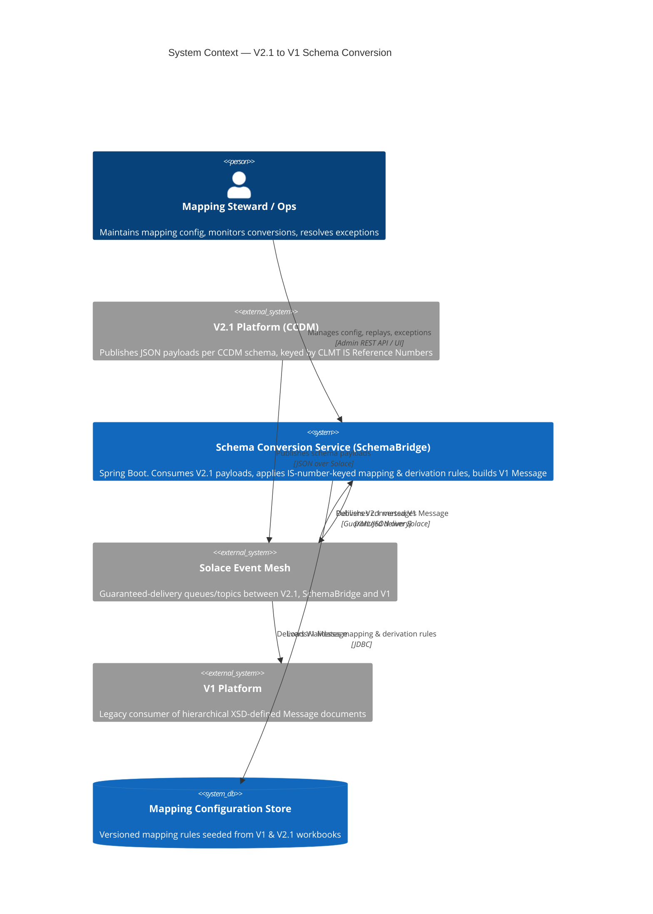
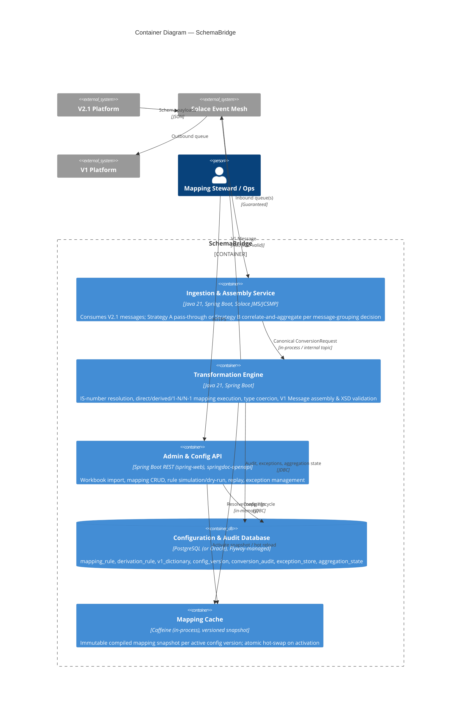
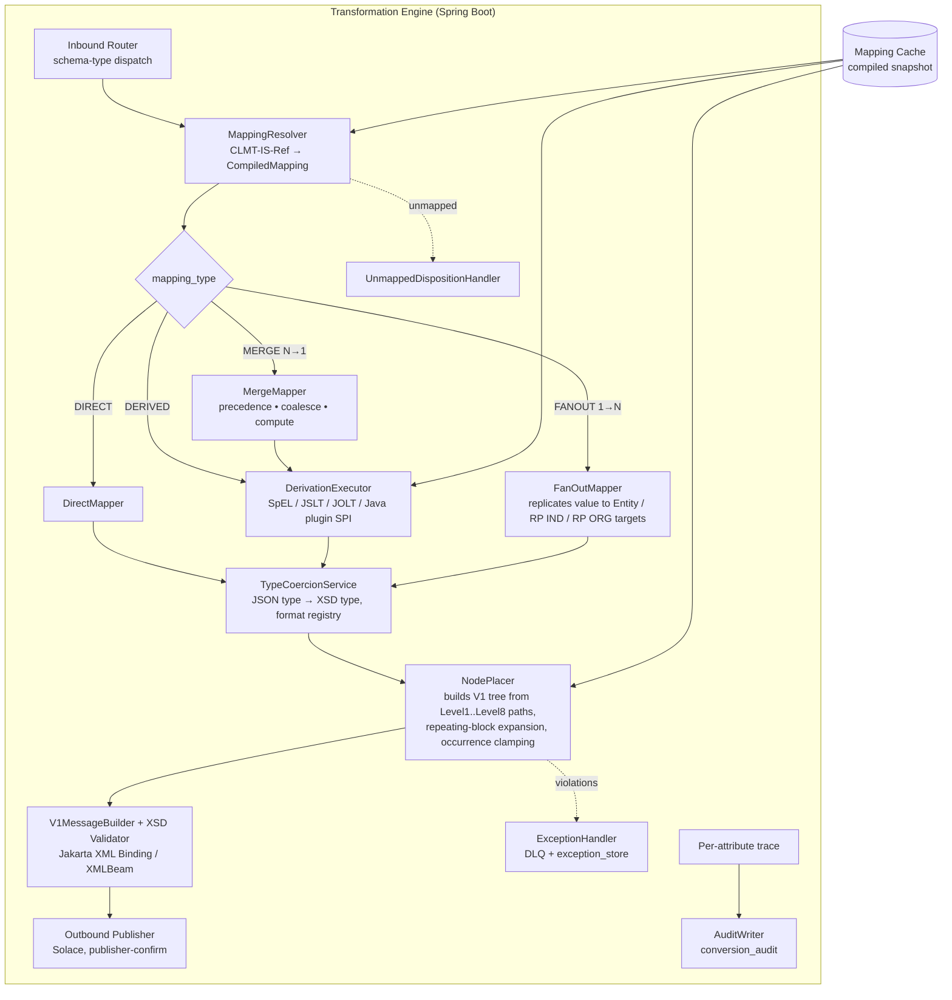
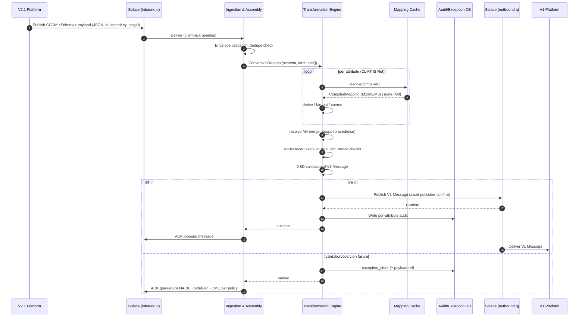
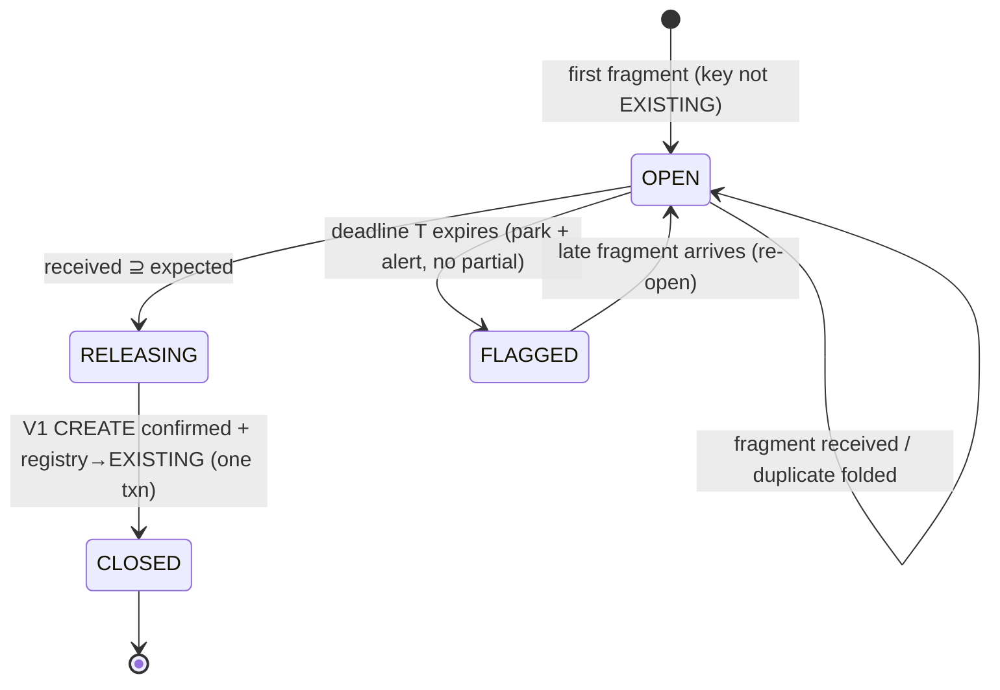
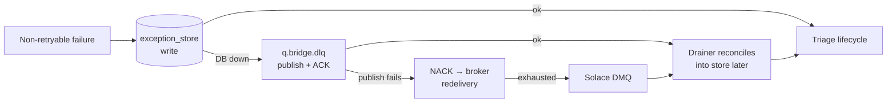
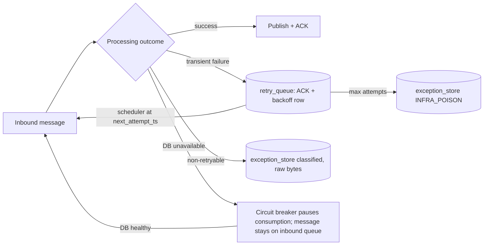

# Software Architecture Document
## CCDM V2.1 → V1 Schema Conversion Service ("SchemaBridge")

| | |
|---|---|
| **Document Status** | Draft v1.0 |
| **Author** | Principal Software Architect |
| **Date** | 10 June 2026 |
| **Architecture Model** | C4 (Context → Container → Component → Code) |
| **Source Artefacts** | `v2_1_mock.xlsx` (CCDM V2.1 attribute catalogue), `v1_mock.xlsx` (V1 schema dictionary) |

---

## 0. Executive Summary

The V2.1 platform publishes data for each CCDM schema (e.g., `CCDM.Trade`, `CCDM.Party`, `CCDM.Custody`) as JSON. Downstream, the legacy **V1** platform consumes a hierarchical, XSD-defined `Message` structure. This document specifies a **configuration-driven transformation service** that consumes V2.1 schema payloads from a **Solace** queue, resolves each V2.1 attribute to its V1 target(s) using the **IS Reference Number** as the linking key, applies direct or derived mapping logic, assembles the V1 `Message` document, and publishes it to V1.

Key architectural stance:

1. **Mapping is data, not code.** All field-level mappings (direct, derived, 1→N, N→1) are externalised into a versioned mapping configuration store seeded from the two workbooks. New mappings and derivation-rule changes are deployed as configuration releases, not code releases.
2. **The IS Reference Number is the join key.** Each V2.1 attribute carries up to three V1 IS targets (`CC_V1_Mapping Entity`, `RP IND`, `RP ORG`); each V1 dictionary row is uniquely keyed by `IS Reference Number` and defines the target node path, XSD type, nullability and occurrence constraints.
3. **Dual ingestion design.** Because it is undecided whether V2.1 will send one collated JSON for all schemas or one message per schema, the design isolates ingestion behind an **Assembly Layer** with two interchangeable strategies (pass-through vs. correlate-and-aggregate). The transformation core is identical in both options.

### 0.1 Empirical profile of the supplied mapping workbooks

The architecture below is sized against the actual data in the two sheets:

| Observation | Count | Architectural consequence |
|---|---|---|
| V1 dictionary element rows (unique IS numbers) | ~1,940 | V1 target dictionary is cacheable in memory |
| V2.1 attribute rows | ~2,000 | Mapping config table of the same order |
| V2.1 attributes with exactly **one** V1 IS target | 1,160 | Direct / single-node mapping path (majority) |
| V2.1 attributes with **three** V1 IS targets (Entity + RP IND + RP ORG) | 154 | Single-node → multi-node fan-out component |
| V1 IS numbers targeted by **more than one** V2.1 attribute | 47 | Multi-node → single-node merge with precedence/derivation rules |
| V2.1 attributes with **no** resolvable V1 IS target | 312 | Explicit "unmapped" disposition required (drop / park / error) — must be a config decision, not silent loss |
| V2.1 attributes sourced from `DDX*` (synthetic/derived DD) | 144 | Derivation-rule engine required |
| 1:1 mappings whose V2.1 type ≠ V1 XSD type (e.g., `Boolean` → `xs:date`) | ~201 | Type-coercion rule library required |
| V1 IS targets referenced by V2.1 but absent from V1 dictionary (e.g., `IS9xxx`) | 30 | Config validation pipeline must reject/flag dangling references at load time, not at runtime |

---

## 1. System Context (C4 Level 1)

### 1.1 Context narrative

The **V2.1 Platform** is the system of record for CCDM-modelled data. For each business schema (`CCDM.Trade`, `CCDM.Account`, `CCDM.Party`, …) it emits a JSON payload onto a **Solace** messaging fabric. The **Schema Conversion Service (SchemaBridge)** — the system being designed — consumes these payloads, transforms them into the V1 hierarchical `Message` structure using the IS-number-keyed mapping configuration, and delivers the result to the **V1 Platform**.

The **IS Reference Number** is the contract between the two worlds:

- In the **V2.1 catalogue**, each attribute row (`CLMT-IS-Ref-nnnn`) names its V1 destination(s) in three columns: `CC_V1_Mapping Entity`, `CC_V1_Mapping RP IND`, `CC_V1_Mapping RP ORG` (values such as `IS0150`; `Not Applicable` where no target exists for that role).
- In the **V1 dictionary**, each element row is keyed by `IS Reference Number` (`IS0001`…) and defines the absolute node path (Level 1…Level 8 + Attribute), the `XSD Field Type`, nullability and min/max occurrence.

Resolution rule: *V2.1 attribute → {IS targets} → V1 node path + type + constraints*.

### 1.2 Context diagram



### 1.3 Actors and external systems

| Element | Type | Responsibility |
|---|---|---|
| V2.1 Platform | External system | Source of truth; emits per-schema CCDM JSON payloads with `CLMT IS Reference Number` semantics |
| Solace Event Mesh | External middleware | Transport for both inbound (V2.1 → SchemaBridge) and outbound (SchemaBridge → V1) flows; provides guaranteed delivery, DMQ (dead-message queue), replay |
| V1 Platform | External system | Consumes the assembled V1 `Message` (XSD-conformant) |
| Mapping Steward / Operations | Human actor | Owns mapping configuration lifecycle (import workbook → validate → approve → activate), monitors DLQ/exception queues |
| SchemaBridge | **System in scope** | Stateless-by-default transformation engine + optional stateful aggregator + admin/config API |

### 1.4 In scope / out of scope

**In scope:** message consumption, mapping resolution, derivation execution, structural assembly (1→1, 1→N, N→1), V1 document construction and validation, publishing, auditing, exception handling, configuration management (import, versioning, validation, hot reload).

**Out of scope:** changes to V2.1 producers, V1 consumer internals, Solace infrastructure provisioning, master-data remediation of the 312 unmapped / 30 dangling-IS rows (flagged as data-governance actions in §6.4).

---

## 2. Container Overview (C4 Level 2)

### 2.1 Container diagram



### 2.2 Container responsibilities

**Ingestion & Assembly Service.** Terminates the Solace connection (durable queue, client-acknowledge), validates the envelope (schema name, correlation/business key, version), normalises the payload into a canonical internal `ConversionRequest`, and applies the configured **assembly strategy** (§5.3): pass-through for the collated-JSON option, or — in Option B2 — an **Entity State Registry lookup** that routes NEW business keys to the correlate-and-aggregate path and EXISTING keys to immediate partial-update conversion (§5.4). Back-pressure is delegated to Solace (consumer flow control); poison messages route to the DMQ after bounded redelivery. The service also hosts the **Dead-Letter Drainer** (§5.4.7), which continuously drains the DMQ, the application DLQ and the V1 reject feed into the exception store for unified triage.

**Transformation Engine.** The heart of the system. Stateless with respect to business data; all behaviour comes from the active mapping snapshot. Pipeline: *resolve → derive → coerce → place → validate → publish* (detailed at component level in §3). Emits one audit record per attribute disposition (mapped / derived / merged / unmapped-dropped / error) keyed by `CLMT IS Reference Number` and target `IS Reference Number`.

**Admin & Config API.** REST surface for the mapping lifecycle: upload V1/V2.1 workbooks, run the **config validation pipeline** (referential check of every IS target against the V1 dictionary — this is where the 30 dangling `IS9xxx` references are caught at import time), diff versions, approve and activate. Also exposes dry-run (`POST /simulate` with a sample payload returns the would-be V1 output plus a per-field trace), replay of audited messages, and exception-queue management. Secured with OAuth2/OIDC (Spring Security, resource server).

**Configuration & Audit Database.** System of record for mapping configuration (versioned, append-only), the imported V1 dictionary, derivation rule definitions, conversion audit, parked exceptions, and (Option B only) transient aggregation state. Flyway manages schema migrations.

**Mapping Cache.** On activation, the engine compiles the active config version into an immutable in-memory snapshot: `Map<ClmtIsRef, CompiledMapping>` plus `Map<IsRef, V1NodeDescriptor>` plus pre-parsed derivation expressions. Lookup is O(1) per attribute; hot-swap is atomic (volatile reference switch), so config releases need no restart.

### 2.3 Core data model (configuration schema)

```
v1_dictionary            (is_ref PK, dd_ref, node_path[1..8], attribute, xsd_type,
                          nullable, min_occurs, max_occurs, config_version_id)
v21_attribute            (clmt_is_ref PK, schema_name, json_path, attribute_name,
                          data_type, min_occurs, max_occurs, mandatory, source_dd,
                          config_version_id)
mapping_rule             (id PK, clmt_is_ref FK, target_is_ref FK, target_role
                          [ENTITY|RP_IND|RP_ORG], mapping_type
                          [DIRECT|DERIVED|FANOUT|MERGE], derivation_rule_id NULL,
                          precedence, config_version_id)
derivation_rule          (id PK, rule_key, rule_kind [EXPRESSION|JOLT_SPEC|JAVA_PLUGIN],
                          rule_body, input_refs[], output_type, test_vector_json,
                          config_version_id)
config_version           (id PK, status [DRAFT|VALIDATED|ACTIVE|RETIRED],
                          source_files, checksum, approved_by, activated_at)
conversion_audit         (msg_id, business_key, clmt_is_ref, target_is_ref,
                          disposition, before/after value hash, latency, ts)
exception_store          (msg_id, stage, reason, payload_ref, status, ts)
aggregation_state        (business_key PK, expected_schemas[], received_schemas[],
                          payload_refs, deadline_ts, lease_expires, status
                          [OPEN|RELEASING|CLOSED|FLAGGED])      -- Option B1/B2 NEW path
retry_queue              (source_msg_id PK, raw_bytes, attempt, next_attempt_ts,
                          backoff_policy)               -- DB_RESIDENT mode only (§5.4.8)
entity_state_registry    (business_key PK, state
                          [PENDING_CREATE|EXISTING|CREATE_REJECTED],
                          first_published_at, last_update_at,
                          last_config_version)                  -- Option B2 routing (§5.4)
```

---

## 3. Component Breakdown (C4 Level 3) — Transformation Engine

### 3.1 Mapping taxonomy

The two workbooks yield exactly four mapping classes. Every `mapping_rule` row is tagged with one, and a dedicated component executes each:

| # | Class | Definition | Evidence in workbooks | Executor component |
|---|---|---|---|---|
| M1 | **Direct (A→B), single node → single node** | One V2.1 attribute resolves to exactly one V1 IS; value copied with at most a type-safe cast | 1,160 rows with a single IS in one of the three mapping columns | `DirectMapper` |
| M2 | **Derived (custom logic)** | Target value computed from one or more V2.1 attributes via an expression/spec/plugin; includes type coercion beyond safe casts | 144 `DDX*`-sourced rows; ~201 rows with V2.1↔V1 type mismatch (e.g., `Boolean → xs:date`) | `DerivationExecutor` |
| M3 | **Single node → multi node (1→N fan-out)** | One V2.1 attribute populates several V1 nodes — typically the Entity / RP IND / RP ORG triple | 154 rows carrying three IS targets (e.g., `CLMT-IS-Ref-0019 → IS1852, IS0123, IS1781`) | `FanOutMapper` |
| M4 | **Multi node → single node (N→1 merge)** | Several V2.1 attributes target the same V1 IS; a merge/derivation rule decides the final value (precedence, coalesce, concatenate, compute) | 47 V1 IS numbers referenced by >1 V2.1 attribute (e.g., `IS0731 ← CLM0023, CLM0024`; `IS1560 ← CLM0034, CLM0035`) | `MergeMapper` (delegates value resolution to `DerivationExecutor`) |
| M0 | **Unmapped** | No resolvable V1 target | 312 rows where all three columns are `Not Applicable`/blank | `UnmappedDispositionHandler` (configured: DROP_AUDITED / PARK / FAIL) |

A fifth structural concern cuts across all classes: **repeating blocks**. V2.1 marks repeating attributes (`Remarks For Repeating Block = Repeating block`, `Max Occurrence = unbounded`); V1 defines occurrence at node level (`Min/Max Occurrence`, including bounded lists like `1..5`). The `NodePlacer` must therefore support *instance expansion* (one V1 node instance per repeating V2.1 element) and *occurrence clamping with violation reporting* (e.g., V2.1 unbounded → V1 max 5).

### 3.2 Component diagram



### 3.3 Component responsibilities

**MappingResolver.** For each attribute in the inbound payload, look up by `CLMT IS Reference Number` (primary) with fallback lookup by `(schemaName, jsonAttributeName)` for producers that omit the IS ref. Returns the compiled mapping(s): zero (→ unmapped disposition), one (M1/M2), or many (M3 fan-out; M4 merge groups are resolved per *target* IS after all source attributes for the message are gathered).

**DirectMapper.** Pure value transfer. Pre-condition checked at config-compile time: source/target types are identical or safely widenable; otherwise the rule is auto-reclassified DERIVED at import and a coercion rule must be supplied — this converts the ~201 type-mismatch rows from a runtime hazard into an import-time work queue.

**DerivationExecutor.** Pluggable rule kinds behind one SPI:
- `EXPRESSION` — Spring SpEL (or MVEL) for scalar logic: coalesce, conditionals, date formatting, lookups (`#lookup('countryCode', src.countryName)`).
- `JOLT_SPEC` / `JSLT` — declarative JSON-shape transforms for structural derivations.
- `JAVA_PLUGIN` — `@Component` implementing `DerivationFunction` for the small tail of logic too complex for expressions; discovered via Spring, referenced by `rule_key`.
Every derivation rule carries a `test_vector_json`; the config validation pipeline executes all vectors before a version can be activated.

**FanOutMapper (M3).** Emits one `(targetIsRef, role, value)` triple per configured target. Roles matter: the same business value may need different coercion per target node (each IS has its own XSD type in the V1 dictionary), so fan-out happens *before* coercion.

**MergeMapper (M4).** Groups all candidate `(clmtIsRef → same targetIsRef)` contributions for the message, orders by configured `precedence`, and applies the merge strategy: `FIRST_NON_NULL` (default), `LAST_WRITE`, `CONCAT(sep)`, or `DERIVED` (hand the contribution set to a derivation rule). Deterministic ordering is mandatory — precedence is part of configuration, never arrival order.

**TypeCoercionService.** Registry of `(sourceType, targetXsdType) → Coercer` with locale/format configuration (date patterns, decimal scale, boolean lexicals `true/1/Y`). Unknown pair → exception, never silent `toString()`.

**NodePlacer.** Materialises the V1 tree. The V1 dictionary's Level 1…Level 8 columns define each IS's absolute path (e.g., `Message/Transaction/TransactionDetails/SubTransaction/Item/@transactionValue`); the placer creates ancestor nodes on demand, honours min/max occurrence (creating mandatory empty-able containers, clamping or erroring on overflow per config), and expands repeating blocks (one node instance per source array element, with index correlation preserved in the audit trail).

**V1MessageBuilder + Validator.** Serialises the tree via Jakarta XML Binding (JAXB) classes generated from the V1 XSD (or a dynamic DOM builder if the XSD evolves frequently), then validates against the XSD before publishing. Validation failure → exception store + DLQ, never an invalid publish. In Option B2 UPDATE mode (§5.4.3), the fragment-level validation profile applies instead of full-document validation.

**UnmappedDispositionHandler.** The 312 unmapped attributes are a *governed* outcome: configuration selects DROP_AUDITED (default — value not carried, audit row written), PARK (payload fragment stored for steward review), or FAIL (reject message). Disposition is configurable per schema and per attribute.

### 3.4 Configuration-driven mapping — externalised format

Mappings are authored in the database (imported from the workbooks) and exportable as YAML for review/Git diff. Illustrative compiled form:

```yaml
configVersion: 2026.06.10-1
mappings:
  - clmtIsRef: CLMT-IS-Ref-0008          # M1 direct
    source: { schema: CCDM.Trade, path: $.tradeLevel, type: Integer }
    targets:
      - { isRef: IS0730, role: ENTITY, mappingType: DIRECT }

  - clmtIsRef: CLMT-IS-Ref-0019          # M3 fan-out 1→3
    source: { schema: CCDM.Party, path: $.partyAmount, type: String }
    targets:
      - { isRef: IS1852, role: ENTITY,  mappingType: DIRECT }
      - { isRef: IS0123, role: RP_IND,  mappingType: DERIVED, rule: party.amount.ind }
      - { isRef: IS1781, role: RP_ORG,  mappingType: DERIVED, rule: party.amount.org }

  - targetIsRef: IS0731                  # M4 merge 2→1
    mappingType: MERGE
    strategy: FIRST_NON_NULL
    contributors:
      - { clmtIsRef: CLMT-IS-Ref-0023, precedence: 1 }
      - { clmtIsRef: CLMT-IS-Ref-0024, precedence: 2 }

derivationRules:
  - key: party.amount.ind
    kind: EXPRESSION
    body: "src.partyType == 'INDIVIDUAL' ? src.partyAmount : null"
    testVectors: [ { in: {partyType: INDIVIDUAL, partyAmount: "10"}, out: "10" } ]
```

---

## 4. Data Flow & Sequence

### 4.1 Flow narrative

V2.1 publishes to Solace; **each schema's payload arrives as one value/message** (per the stated behaviour) on the inbound queue. SchemaBridge consumes with guaranteed delivery and client acknowledgement: a message is acknowledged only after the V1 output has been accepted by the Solace publisher (publisher confirm) *or* the message has been durably parked (exception store / DMQ). This yields at-least-once end-to-end; idempotency is achieved with a dedupe key `(businessKey, schemaName, sourceMessageId)` checked against `conversion_audit`.

Solace topology (DMQ and `q.bridge.dlq` rows apply in `BROKER_NATIVE` mode; see §5.4.8 for the DB-resident alternative if the estate cannot provide them):

| Endpoint | Type | Purpose |
|---|---|---|
| `q.v21.ccdm.inbound` (optionally per-schema: `q.v21.ccdm.trade`, …) | Durable queue | V2.1 → SchemaBridge |
| `q.bridge.v1.outbound` | Durable queue | SchemaBridge → V1 |
| `#DEAD_MSG_QUEUE` (broker DMQ) | DMQ | Broker-side dead-lettering after max redelivery (cause unknown until triaged, §5.4.7) |
| `q.bridge.dlq` | Durable queue | Application dead-letter: classified non-retryable messages, raw bytes + diagnostic envelope; also the fallback durability path if the exception-store write fails (§5.4.7) |
| `q.v1.reject` | Durable queue | V1 processing rejects of published CREATE/UPDATE messages, drained into the exception lifecycle (§5.4.7, D-3) |
| `t.bridge.audit` (optional) | Topic | Streaming audit events to observability stack |

Ordering: where V1 requires per-business-key ordering, partition by business key (Solace partitioned queues or keyed topic-to-queue mapping) so one consumer thread owns a key at a time.

### 4.2 Sequence — steady-state conversion (message-per-schema arrival)



### 4.3 Sequence — Option B2 NEW-entity aggregation (full cohort required before CREATE)

When the Entity State Registry classifies a business key as NEW (§5.4), the Assembly layer must collect the full expected schema set before the engine builds the V1 `CREATE`; on timeout the cohort is flagged out — no partial publish for new entities. EXISTING keys bypass this sequence entirely and follow §4.2 directly, publishing partial `UPDATE`s:

```mermaid
sequenceDiagram
    autonumber
    participant SOL as Solace
    participant ING as Assembly (Aggregator)
    participant ST as aggregation_state (DB)
    participant ENG as Engine

    SOL->>ING: CCDM.Trade (businessKey K)
    ING->>ST: upsert state(K): received={Trade}, deadline=t+T
    SOL->>ING: CCDM.Party (K)
    ING->>ST: received={Trade,Party}
    alt all expected schemas received
        ING->>ENG: ConversionRequest(collated payloads for K)
        ING->>ST: delete state(K)
    else deadline expires
        ING->>ST: state(K) -> FLAGGED (park + alert, missing = expected − received)
        Note over ING,ST: NEW path forbids partial publish; late fragment re-opens cohort (§5.4.2)
    end
```

---

## 5. Technical Constraints & Decisions

### 5.1 Technology stack (decided + recommended open source)

| Concern | Choice | Rationale |
|---|---|---|
| Runtime / framework | **Java 21 LTS, Spring Boot 3.x** | Mandated; virtual threads suit I/O-bound transform-and-publish workloads |
| Messaging | **Solace** via `solace-spring-boot-starter` (JMS) or JCSMP for fine-grained flow control / publisher confirms | Mandated transport; JCSMP recommended for guaranteed-delivery semantics |
| Integration framework | **Spring Integration** (or **Apache Camel**) | Declarative routing, aggregator pattern (Option B), DLQ wiring, retry/idempotent-receiver EIPs out of the box |
| Declarative JSON transforms | **JOLT** and/or **JSLT** | Configuration-as-data structural transforms for M2/M3 without code releases |
| Expression rules | **Spring SpEL** (alt. MVEL) | Lightweight scalar derivations; sandboxed `SimpleEvaluationContext` |
| Complex rule tail (optional) | **Easy Rules** or **Drools** | Only if rule interdependencies grow beyond expressions; start without |
| Bean/object mapping in code paths | **MapStruct** | Compile-time-safe mapping for internal canonical model |
| JSON | **Jackson** (+ `jackson-dataformat-xml` if needed) | De facto standard |
| XML / XSD output | **Jakarta XML Binding (JAXB 4)** + Xerces XSD validation | V1 dictionary is XSD-typed (`xs:*`); generate classes from V1 XSD |
| Config DB & migrations | **PostgreSQL + Flyway** | Versioned mapping store, audit |
| Workbook import | **Apache POI** (streaming `XSSF`) | Ingest the V1/V2.1 xlsx at config-import time |
| Cache | **Caffeine** | Immutable compiled mapping snapshot, atomic hot swap |
| Resilience | **Resilience4j** | Retry/circuit-break around DB and Solace publish |
| Observability | **Micrometer + OpenTelemetry**, structured logs with `businessKey`/`msgId`/`clmtIsRef` MDC | Per-attribute traceability is a first-class requirement |
| API docs / security | **springdoc-openapi**, **Spring Security (OAuth2 resource server)** | Admin API governance |
| Testing | JUnit 5, Testcontainers (PostgreSQL, Solace PubSub+ container), ArchUnit, Pact (optional, V1 contract) | Config releases gated by executing all derivation test vectors |

### 5.2 Key architecture decisions (ADR summary)

**ADR-01 — Mapping configuration externalised and versioned (Accepted).** All M0–M4 behaviour lives in `mapping_rule`/`derivation_rule`, imported from the workbooks, validated (referential integrity against `v1_dictionary`, type-pair coverage, derivation test vectors), approved, then atomically activated. *Consequence:* mapping changes are ops-grade releases with diff and rollback; the 30 dangling IS references become import-time rejections.

**ADR-02 — IS Reference Number is the sole join key (Accepted).** `CLMT IS Reference Number` identifies the V2.1 attribute; `CC_V1_Mapping {Entity, RP IND, RP ORG}` carry the V1 IS target(s); `IS Reference Number` keys the V1 node descriptor. Name-based matching is fallback-only and flagged in audit.

**ADR-03 — At-least-once + idempotent conversion (Accepted).** Client-ack after publisher confirm; dedupe on `(businessKey, schemaName, sourceMessageId)`. Exactly-once is not assumed from the mesh.

**ADR-04 — Transformation core is assembly-strategy agnostic (Accepted).** The engine consumes a canonical `ConversionRequest` whether it originated from one collated JSON or an aggregated set of per-schema messages. This is what makes §5.3's open decision low-risk.

**ADR-05 — Derivation logic sandboxed and test-vectored (Accepted).** Expressions run in restricted evaluation contexts; every rule ships executable test vectors; Java plugins are the escape hatch, code-reviewed like any code.

**ADR-06 — Entity lifecycle determines assembly behaviour in Option B2 (Accepted).** Routing is per business key against the Entity State Registry: NEW entities require the full schema cohort before a `CREATE` is published (timeout → flag-out, never partial); EXISTING entities flow as immediate partial `UPDATE`s. The registry flip to `EXISTING` is transactional with cohort close and gated on the V1 publish confirm. *Consequence:* one new registry component, two validation profiles (CREATE vs UPDATE), and two interface contracts with V1 (initial key load + ack/reject feed; absence-means-no-change update semantics). Detailed in §5.4.

**ADR-07 — Retry ownership hands over at the durability boundary (Accepted).** The Solace broker drives retry only until a fragment is durably persisted in `aggregation_state` (ACK strictly after commit); thereafter the persisted cohort is the sole retry source, recovered by a lease-based sweep. Infra failures retry on a timer; deterministic failures (`FLAGGED`) retry only on config activation or manual replay. Outbound message IDs are deterministic — `(businessKey, cohortId, configVersion)` — making re-publish idempotent end-to-end. Detailed in §5.4.6. Where the Solace estate cannot provide DMQ/DLQ, the same semantics run in `DB_RESIDENT` mode (retry table + consumption-pause backstop, §5.4.8) — the lifecycle is transport-agnostic.

### 5.3 Open constraint — V2.1 delivery granularity: design for both options

It is **not yet decided** whether V2.1 will deliver (A) a single request collating all schemas in one JSON, or (B) one message per schema. The design supports both behind the Assembly Layer; only the strategy bean and two queues differ.

**Option A — single collated JSON per business event**

```
V2.1 ──▶ q.v21.collated ──▶ [PassThroughAssembler] ──▶ Engine ──▶ V1 Message
```

- Assembler: trivial pass-through; splits the collated document into per-schema sections and hands one `ConversionRequest` to the engine.
- M4 merges and cross-schema derivations are evaluated within one message — **no state, no correlation**.
- Pros: stateless, simplest failure model (one inbound message ↔ one outbound message), trivial replay, lowest latency, exactly one audit scope.
- Cons: large messages (size limits / Solace max payload), V2.1 must already possess all schemas (coupling and latency pushed upstream), one bad schema section can block the whole event (mitigate with per-section error isolation + PARTIAL completeness flag).
- Recommended when V2.1 can stage a complete business event.

**Option B — one message per schema**

Two sub-modes, selectable per V1 output contract:

*B1 — Correlate-and-aggregate (one V1 Message per business key).*
```
V2.1 ──▶ q.v21.ccdm.<schema> ──▶ [AggregatingAssembler + aggregation_state] ──▶ Engine
```
- Spring Integration Aggregator keyed by `businessKey`; release on completeness (`expected_schemas` from config — note many V1 root nodes are mandatory `1..1`, so the expected set is derivable from the V1 dictionary) or on timeout `T`.
- Timeout policy configurable: `PUBLISH_PARTIAL` (V1 Message with only optional nodes missing, completeness flag in header), `PARK`, or `FAIL`.
- State persisted (DB-backed message store), so aggregation survives restarts; duplicates folded by dedupe key.
- Pros: decoupled producers, small messages, per-schema retry.
- Cons: stateful service, late/missing-schema handling, out-of-order tolerance, more complex replay (must replay the cohort).

*B2 — Entity-lifecycle hybrid (CONFIRMED REQUIREMENT: wait-for-all on new entities, partial updates on existing).*
Routing is per **business key**, not per schema, based on whether the entity already exists in V1:

- **NEW entity** (business key unknown to V1): fragments are held by the aggregator until the **full expected schema set** is received; the complete V1 `Message` is published as a `CREATE`. If the completeness deadline expires, the cohort is **flagged out** (parked + alerted) — there is no partial publish for new entities.
- **EXISTING entity** (business key already created in V1): each fragment converts immediately and is published as a **partial `UPDATE`** containing only that schema's subtree — no waiting, no correlation.

The NEW/EXISTING decision is served by a new component, the **Entity State Registry** (§5.4). Cross-schema rules (`requiresCohort=true` — several of the 47 M4 merges) are fully evaluable on the CREATE path; on the UPDATE path they follow the per-rule policy in §5.4.4. Full protocol, failure semantics and race handling are specified in §5.4.

**Decision guidance:** implement the `AssemblyStrategy` interface with all three; default profile A if V2.1 confirms collation, else **B2 (entity-lifecycle hybrid)**, which subsumes B1 — B1 is simply B2's NEW path applied unconditionally. The transformation engine, config model, audit and V1 builder are byte-identical across options (ADR-04), so the open decision does not block build start.

### 5.4 Option B2 protocol — entity lifecycle, completeness and failure semantics

#### 5.4.1 Entity State Registry

A registry table answers "does V1 already know this business key?":

```
entity_state_registry (business_key PK, state [PENDING_CREATE|EXISTING|CREATE_REJECTED],
                       first_published_at, last_update_at, last_config_version)
```

Routing rule per inbound fragment: registry **miss or `PENDING_CREATE`** → aggregator (fragment joins or opens a cohort); **`EXISTING`** → immediate conversion, publish partial `UPDATE`.

Registry lifecycle guarantees:
- The key flips to `EXISTING` **in the same database transaction** that closes the aggregation state, and only after the V1 `CREATE` publish receives its Solace publisher confirm. This ordering means a crash can never leave fragments flowing as updates against an entity V1 never received.
- **Seeding:** entities that exist in V1 before go-live require a one-time initial key load from V1; otherwise day-one fragments for old entities would wait forever for cohorts that will never form (dependency D-2, §6.3).
- **V1 ack/reject feed (recommended):** if V1 rejects a `CREATE`, the registry rolls the key to `CREATE_REJECTED` and subsequent fragments are parked, not silently sent as updates into the void. Without a feed, periodic reconciliation against V1 substitutes (dependency D-3).

#### 5.4.2 NEW-entity path — completeness then flag-out

The B1 aggregator with a stricter timeout policy:

- **Expected set** derived from configuration: every V1 root node with `minOccurs ≥ 1` whose attributes have at least one active mapping implies a required source schema; overridable per business-event type; versioned with the mapping config.
- **State machine:** `OPEN → (received ⊇ expected) → RELEASING → CLOSED+registry flip` or `OPEN → deadline → FLAGGED`. State is DB-persisted (`aggregation_state`), so cohorts survive restarts and any consumer instance can receive any fragment.
- **Timeout = flag-out:** cohort moves to the exception store with the explicit missing-schema list (`expected − received`), alert raised, inbound fragments ACKed (durably parked; redelivery cannot help). `PUBLISH_PARTIAL` is **not permitted** on the NEW path.
- **Late arrival auto-heal:** a fragment arriving for a `FLAGGED` cohort re-opens it; if completeness is now satisfied, the cohort releases and publishes the `CREATE` without manual replay.
- **Races, by construction:** two concurrent fragments for the same new key → unique constraint on `aggregation_state.business_key` + upsert, second writer joins. Fragment arriving between release and registry flip → `OPEN → RELEASING → CLOSED` transitions and the flip share one transaction, so the straggler either joins the still-open cohort or reads `EXISTING`; there is no window in which it can be lost.



#### 5.4.3 EXISTING-entity path — partial updates

- **Operation semantics:** the V1 `Message` carries `operation=UPDATE` (envelope/header field — contract item with V1, D-4) and contains only the populated subtree(s). V1 must treat **absence as "no change", never "delete"** — this must be explicit in the interface agreement or partial updates will silently null fields.
- **Validation profiles per operation:** `CREATE` → full XSD validation (all mandatory `1..1` roots present). `UPDATE` → fragment-level validation only (types, occurrence within the supplied subtree); document-level mandatory checks relaxed. Both profiles are generated from the same V1 dictionary.
- **Failure isolation:** a failed `UPDATE` never touches the registry; subsequent fragments for the same key keep flowing — updates fail independently, which is the isolation the partial-update mode exists to provide.

#### 5.4.4 Cross-schema rules (`requiresCohort=true`) in UPDATE mode

Configurable per rule:

| Policy | Behaviour | When to use |
|---|---|---|
| `SKIP_AUDITED` (default) | Rule not evaluated; target field untouched in the update; audit row records the skip and why | Safe default — derived field refreshes on the next event that carries all contributors |
| `LAST_KNOWN_VALUE` | Engine keeps a per-`(businessKey, clmtIsRef)` snapshot of last-published source values and re-evaluates the rule using the new fragment + cached siblings | Only where the business demands fresh derived values on every update; adds a value cache with retention/PII implications — promote individual rules deliberately |

#### 5.4.5 Failure model summary (B2)

| Failure class | Retryable? | Disposition |
|---|---|---|
| Envelope/pre-validation (malformed, no business key, unknown schema) | No | Exception store stage=`INGEST`, ACK, copy to DLQ; alert keyed by schema |
| Mapping resolution miss (unknown `clmtIsRef` — config drift) | No (redelivery useless) | `PARK` (auto-replay on next config activation) or `DROP_AUDITED`, per schema |
| Derivation/coercion/mandatory-null | No | Collect **all** field violations, then: all-optional → `PUBLISH_DEGRADED` (audited omissions); any mandatory → park message/fragment |
| XSD validation of built output | No (defect) | Park + page; should be precluded by config validation |
| Infrastructure (DB, Solace confirm timeout) | **Yes** | Resilience4j retry/backoff → NACK → redelivery → DMQ; idempotent via dedupe key, no double-delivery |
| NEW-cohort timeout | n/a | Flag-out per §5.4.2 |

#### 5.4.6 Retry semantics on the aggregation (B1 / NEW-entity) path

**Governing principle — retry ownership hands over at the durability boundary.** Until a fragment is durably written to `aggregation_state`, the **Solace broker** owns recovery (redelivery). From the moment that write commits and the fragment is ACKed, the broker is out of the picture: the **persisted cohort row** becomes the sole retry source of truth. Every rule below follows from keeping that handover clean.

**Stage 1 — fragment ingestion (broker-driven).**
- ACK rule: a fragment is ACKed to Solace **only after** the `aggregation_state` upsert commits.
- Transient failure on the upsert (DB blip): in-process retry (Resilience4j, exponential backoff + jitter, bounded attempts) → still failing → NACK → broker redelivery (any instance) → DMQ after max redelivery. Nothing lost, nothing was ACKed.
- Crash between commit and ACK: the redelivered duplicate folds into the cohort as a no-op — the `received_schemas` set is keyed by `sourceMessageId`, so the join is idempotent. At-least-once delivery + idempotent join = effectively-once aggregation.
- Non-retryable envelope failures (malformed payload, missing business key): never NACK-loop these — ACK, exception store (stage=`INGEST`), DLQ copy.

**Stage 2 — cohort release & transformation (state-driven).** Fragments are already ACKed; broker redelivery is unavailable *by design*. Two failure classes with deliberately different retry behaviour:
- *Transient/infra* (audit write fails, instance dies mid-transform): cohort remains `RELEASING` with a **lease timestamp**. A recovery sweep (scheduled + on-startup) claims lease-expired `RELEASING` cohorts via `UPDATE … WHERE status='RELEASING' AND lease_expires < now()` (exactly one claimant wins) and re-runs the transformation from the persisted `payload_refs`. Safe to repeat: transformation is deterministic given (payloads, config version) and publish is idempotent (Stage 3).
- *Deterministic* (derivation rule throws, coercion failure, XSD-invalid output): re-execution fails identically, so **no automatic timer-based retry**. Cohort → `FLAGGED` with the complete violation list. Recovery is **config-driven replay**: activating a new config version auto-re-releases all cohorts parked with a config-attributable reason; the Admin API provides manual replay for the rest.
- Design rule: **infra errors retry on a timer; logic errors retry on a config release.** Conflating them yields either hot-loops on broken rules or stewards hand-replaying network blips.

**Stage 3 — publish to V1 (idempotent retry).** A publisher-confirm timeout is ambiguous (the message may or may not have reached the broker), so re-publish must be harmless:
- The outbound message ID is **deterministic** — derived from `(businessKey, cohortId, configVersion)`, never a per-attempt UUID — so a re-publish carries the same ID and is deduplicated downstream (and SchemaBridge checks `conversion_audit` for an existing confirm before re-publishing).
- Sustained confirm failures (broker outage): circuit breaker opens; cohort stays `RELEASING`; the sweep retries when the breaker half-opens. Latency, not loss.

**Stage 4 — close transaction.** After confirm, one DB transaction performs `RELEASING → CLOSED` plus (NEW path) the registry flip to `EXISTING`. A crash between confirm and commit is harmless: the sweep re-runs the cohort, the publish dedupes on the deterministic ID, and the close commits on the second pass. The ordering — publish first, close second, idempotent publish — is what makes the crash window safe.

**Retry ownership summary:**

| Stage | Failure | Retry driver | Mechanism | Terminal outcome |
|---|---|---|---|---|
| Fragment ingest | Transient (DB) | In-process → **Solace** | Backoff → NACK → redelivery → DMQ | DMQ after max redelivery |
| Fragment ingest | Envelope invalid | None (non-retryable) | ACK + exception store + DLQ copy | Steward review |
| Release/transform | Infra/transient | **Recovery sweep** | Lease-expired `RELEASING` re-run from `payload_refs` | Retries until healthy; alert on age |
| Release/transform | Deterministic (rule/coercion/XSD) | **Config activation** / manual | `FLAGGED`; auto-replay on new config version; Admin API replay | Parked until fixed |
| Publish | Confirm timeout / outage | Sweep + circuit breaker | Re-publish with deterministic message ID (dedupe) | Retries until broker healthy |
| Close txn | Crash after confirm | Sweep | End-to-end idempotent re-run | Self-heals |

**Operational metrics that matter:** `RELEASING` age (stuck cohort = sweep failure — page), `FLAGGED` count by reason code (spike after a config release = the release broke a rule), DMQ depth, and dedupe-hit rate on outbound publish (rising rate = confirm path degrading). Raw retry counts alone hide all four.

**Scope note:** a *missing schema* is not an error and never enters this retry machinery — it is the timeout/flag-out path of §5.4.2, healed by late arrival, not by retry.

#### 5.4.7 Dead-letter architecture — DMQ, DLQ and exception lifecycle

**Principle: a dead-lettered message is not a terminal state; it is an unprocessed work item carrying a pending business obligation.** Every dead message must reach exactly one terminal disposition. The design distinguishes three dead-letter surfaces with different actors and semantics, unified into one triage lifecycle.

**The three surfaces:**

| | **Solace DMQ** | **Application DLQ** (`q.bridge.dlq`) | **V1 reject feed** (`q.v1.reject`) |
|---|---|---|---|
| Who sends to it | The **broker**, automatically, after max redelivery | **SchemaBridge**, deliberately, for classified non-retryable messages | **V1**, for messages accepted from the broker but rejected on processing |
| Diagnostic state on arrival | Unknown (service kept NACKing) | Pre-diagnosed: reason code, stage, businessKey, config version | V1-side reject reason |
| Content | Original message as last held by broker | Original **raw bytes + broker headers** plus diagnostic envelope | Outbound message ref + reject detail |

**Why a DLQ exists alongside the `exception_store`** (which remains the single system of record and workflow engine):

1. **Forensic fidelity.** The store holds the parsed, enriched view; the DLQ holds the exact wire bytes with original broker headers — the evidence for producer disputes ("we never sent that") and the source for byte-faithful replays.
2. **Integration point.** SIEM, enterprise monitoring and the V2.1 producer team subscribe to failure events on the mesh without database access.
3. **Fallback durability — the failure-of-failure-handling path.** If the `exception_store` write itself fails (DB outage while parking a message), the DLQ publish is the independent durability path. Ordering rule: attempt store write → on failure, publish to DLQ and ACK → drainer reconciles later. If both DB *and* DLQ publish fail → NACK → broker redelivery → DMQ. This yields an independent backstop hierarchy in which no single failure mode loses the exception record:



**Step 1 — Drain and capture.** A **Dead-Letter Drainer** (component of the Ingestion & Assembly Service) continuously consumes the DMQ, the DLQ and the V1 reject feed, landing every message in `exception_store` (payload encrypted; envelope metadata extracted: businessKey, schema, `sourceMessageId`, redelivery count, timestamps; raw-bytes reference attached). Deduplication on `sourceMessageId`: a message already parked directly in the store gains its raw-copy reference; one that bypassed the store (DB-outage path) is created. Messages must not live on broker queues: queues have size/retention limits and no queryability or workflow state. Consequence for alerting: **DMQ depth > 0 beyond minutes is anomalous (page); DLQ depth is normal — alert on *drainer lag* (oldest unconsumed DLQ message age), not depth.**

**Step 2 — Classify into remediation buckets** (automated where possible; DLQ arrivals carry their bucket; DMQ arrivals get a diagnostic pass first — outage-window correlation, re-parse probe):

| Bucket | Typical cause | Remediation path |
|---|---|---|
| `INFRA_POISON` | Retries exhausted during an outage now over | **Auto-replay** once health checks pass — no human action |
| `CONFIG_DRIFT` | Unknown `clmtIsRef` / rule failure | Held; **auto-replay on next config activation** (same trigger as `FLAGGED` cohorts, §5.4.6) |
| `DATA_DEFECT` | V2.1 sent semantically invalid data | **Return to producer** with the exact attribute trace; the bridge never "fixes" source data |
| `MALFORMED` | Unparseable, no business key | Discard candidate via governed approval only |
| `V1_REJECTED` | V1 processing reject of a published CREATE/UPDATE | Tied back to the Entity State Registry (`CREATE_REJECTED` flip, §5.4.1); steward triage |

**Step 3 — Replay, with two traps designed out.** Replay re-injects the original bytes into the normal inbound flow (Admin API: single / bulk-by-reason / bulk-by-window):
- *Routing is evaluated at replay time, not original time.* A fragment that died while its entity was NEW may replay after the entity became EXISTING — the fresh registry lookup routes it as an `UPDATE`; it never attempts to rejoin a closed cohort.
- *Staleness guard.* The message's source event timestamp is compared against `last_update_at` in the registry/audit; if newer data has since been published for the overlapping fields, the replay is held for steward confirmation (or auto-skipped with audit, per policy). The idempotency dedupe key carries a `replay_attempt` dimension so a legitimate replay is not swallowed as a duplicate of its own failed original.

**Step 4 — Terminal disposition (governance).** Every exception row must end in exactly one of `REPLAYED_OK`, `RETURNED_TO_PRODUCER`, or `DISCARDED_APPROVED`. Discard is a business decision to drop data: privileged role, four-eyes approval, recorded justification. Operational invariant, alerted: **zero exceptions in non-terminal state older than N days.** A weekly steward report by bucket × schema makes producer-quality trends visible (a rising `DATA_DEFECT` count for one schema is a V2.1 conversation, not a bridge defect).

**Step 5 — Reconciliation backstop.** A periodic job asserts the global invariant: *every inbound `sourceMessageId` is accounted for* — published, in an open cohort, or terminally dispositioned. Anything unaccounted is found in reconciliation, not in an audit.

**Retention & access.** The DLQ carries raw payloads (potential PII): Solace queue ACLs restricted to the drainer plus named forensic roles; broker-side TTL aligned with the store's retention clock (e.g., payload purge 90 days after terminal disposition, disposition metadata retained for audit).

#### 5.4.8 Alternate flow — dead-lettering without broker DMQ/DLQ (DB-resident mode)

If the organisation's Solace estate cannot provide a DMQ (broker config / entitlement) or additional DLQ queues, the **lifecycle of §5.4.7 is unchanged; only the transport moves into the database.** The dead-letter transport is therefore a deployment profile, not a design fork:

```
deadLetterMode: BROKER_NATIVE   # DMQ + q.bridge.dlq as per §5.4.7
deadLetterMode: DB_RESIDENT     # this section
```

**A-1 — DMQ unavailable (DLQ queue still possible).** The broker can no longer enforce "max redelivery → DMQ", so the application enforces it: read the redelivery counter (`JMSXDeliveryCount` on Solace JMS), and when it exceeds the threshold, classify and **park to `exception_store` + ACK** instead of NACKing again. If the message is so malformed that no `sourceMessageId` can be extracted, key the attempt count on a hash of the raw bytes. Everything downstream (buckets, replay, disposition) is identical.

**A-2 — Neither DMQ nor DLQ available (fully DB-resident).** Four substitutions:

1. **Retry transport → retry table.** Instead of NACK-driven broker redelivery, transient failures are handled by **ACK + insert into a `retry_queue` table** (`source_msg_id, raw_bytes, attempt, next_attempt_ts, backoff_policy`); a scheduler re-injects due rows into the normal inbound flow. Exponential backoff lives in the table, not the broker. After max attempts the row migrates to `exception_store` as `INFRA_POISON`. This removes redelivery storms entirely and gives queryable, per-message retry state — at the cost of the DB becoming the retry engine.
2. **Forensic copy → raw bytes in the store.** `exception_store` (and `retry_queue`) persist the original wire bytes + broker headers as an encrypted blob, so no DLQ queue is needed for byte-faithful replay or producer disputes.
3. **Fallback durability → consumption pause, not a second queue.** The §5.4.7 backstop chain (store → DLQ → DMQ) collapses to a simpler and equally safe rule: **if the database is unavailable, stop consuming.** A health-gated circuit breaker pauses the Solace consumer (flow control / unbind) so unACKed messages remain safely on the *inbound* queue — the inbound queue itself is the durability backstop. Nothing is ACKed that is not durably recorded; nothing loops. Consumption resumes automatically when the DB health check passes.
4. **Integration point → push, not subscribe.** Without a DLQ topic for SIEM/producer teams to subscribe to, failure events are exposed via the Admin API (paged exception feed), scheduled webhook/report delivery to the V2.1 team, and Micrometer events to the monitoring stack.



**Trade-offs vs BROKER_NATIVE:**

| Concern | BROKER_NATIVE (§5.4.7) | DB_RESIDENT (this section) |
|---|---|---|
| Retry engine | Broker redelivery + DMQ | `retry_queue` table + scheduler |
| Survives DB outage while parking | Yes (DLQ publish path) | Yes (consumption pause; inbound queue holds) |
| Redelivery storms possible | Yes (mitigate with redelivery delay) | No (backoff is data) |
| Per-message retry observability | Poor (broker counters) | Excellent (queryable rows) |
| Extra DB load / retention | Low | Higher: raw payload blobs + retry churn (size & vacuum policy needed) |
| Ordering during retry | Broker redelivery order | Re-injection may reorder — acceptable because the aggregator is order-insensitive and UPDATE staleness is guarded (§5.4.7); enforce per-key serialisation in the scheduler where V1 ordering matters |
| External failure-event consumers | Mesh subscription | API feed / webhook / report |

**Decision guidance:** confirm with the Solace platform team first — DMQ is a standard PubSub+ capability and often a configuration request rather than a feasibility gap (dependency D-6). Choose `DB_RESIDENT` only where the estate genuinely cannot provide it; do not run a hybrid of both retry engines for the same queue — split retry state is harder to reason about than either pure mode.

### 5.5 Cross-cutting concerns

- **Performance:** O(1) mapping lookup from the compiled snapshot; ~2,000 attributes per full message is trivial per-message CPU; horizontal scale via competing consumers on the queue (key-partitioned where ordering matters).
- **Security:** TLS to Solace and DB; no payload PII in logs (hash values in audit by default, raw payloads only in encrypted exception store with retention policy); admin API behind OAuth2 + role-based config approval (author ≠ approver).
- **Auditability:** every attribute disposition traceable: inbound msgId → clmtIsRef → rule version → target isRef → outbound msgId.
- **Config lifecycle:** DRAFT → VALIDATED (referential + type-pair + test-vector checks) → ACTIVE (atomic snapshot swap) → RETIRED; full diff between versions exposed by the API.

---

## 6. Risks, Assumptions, Dependencies

### 6.1 Assumptions
1. A stable **business key** exists in every V2.1 payload to correlate schemas, key idempotency/ordering, and drive the NEW/EXISTING routing decision (§5.4).
2. V1 ingestion is via Solace and accepts XSD-valid `Message` XML (the V1 dictionary is XSD-typed). If V1 instead expects JSON, only the `V1MessageBuilder` serialisation changes.
3. The workbooks are the authoritative mapping source and will be re-imported on change (no out-of-band edits to the DB).
4. V1 supports an `operation` discriminator (`CREATE` vs `UPDATE`) and interprets **absence of a node in an UPDATE as "no change", never "delete"** (§5.4.3 — to be confirmed in the V1 interface agreement, D-4).

### 6.2 Risks & mitigations

| Risk | Impact | Mitigation |
|---|---|---|
| 312 V2.1 attributes have no V1 target | Silent data loss or noisy failures | Governed `UnmappedDispositionHandler` + steward report at import |
| 30 IS targets absent from V1 dictionary (`IS9xxx`) | Runtime placement failure | Import-time referential validation blocks activation |
| ~201 type-mismatched 1:1 mappings | Bad coercions (e.g., Boolean→date) | Auto-reclassify to DERIVED at import; activation blocked until a coercion rule + test vector exists |
| Duplicate-attribute rows (e.g., two `portfolioIndicator`, two `partyDescription` with different DDs) | Ambiguous resolution | Composite resolution key `(schema, clmtIsRef)`; name-based fallback disabled where ambiguous |
| Occurrence conflicts (V2.1 unbounded → V1 max 5) | Truncation | Configurable clamp-with-audit vs. reject; surfaced in import report |
| NEW-cohort timeout tuning (Option B2 §5.4.2) | Flagged cohorts pile up / entities never created | Per-schema SLAs, stuck-cohort age gauge (alert at 50% of deadline, broken down by missing schema), late-arrival auto-heal |
| Registry drift vs V1 reality (CREATE rejected by V1, or V1-side purges) | Updates sent for entities V1 doesn't hold | V1 ack/reject feed flips key to `CREATE_REJECTED`; periodic reconciliation as fallback (D-3) |
| Unseeded registry at go-live | Pre-existing entities wrongly treated as NEW and parked forever | Mandatory one-time business-key initial load before cutover (D-2) |
| Partial-update semantics misread by V1 (absence treated as delete) | Silent field nulling | Explicit interface contract + contract tests (Pact) on the UPDATE message shape (D-4) |
| Dead-letter pile-up (exceptions never dispositioned) | Silent data loss disguised as "parked" | Terminal-disposition invariant: zero non-terminal exceptions older than N days (alerted); weekly steward report by bucket × schema; reconciliation job asserting every `sourceMessageId` is accounted for (§5.4.7) |
| Stale replay regressing V1 to old values | Data corruption on EXISTING entities | Staleness guard: replay compared against `last_update_at`; held for steward confirmation or auto-skipped with audit (§5.4.7) |
| Expression rule sprawl | Unmaintainable logic in config | Rule review workflow, mandatory test vectors, promote recurring patterns to named library functions |

### 6.3 Dependencies
- **D-1** — Confirmation of V2.1 delivery granularity (drives Option A vs B2 profile) and the business-key contract.
- **D-2** — One-time initial load of existing business keys from V1 to seed the Entity State Registry before cutover (§5.4.1).
- **D-3** — V1 ack/reject feed for published `CREATE`s (preferred), or agreed reconciliation extract as fallback (§5.4.1).
- **D-4** — V1 interface agreement on the `operation` discriminator and absence-means-no-change UPDATE semantics (§5.4.3).
- **D-5** — V1 acceptance format (XML vs JSON), Solace queue/topic provisioning, and remediation owners for the §6.2 data-quality items.
- **D-6** — Solace platform confirmation of DMQ capability and DLQ queue provisioning; outcome selects `deadLetterMode` (`BROKER_NATIVE` vs `DB_RESIDENT`, §5.4.8).

---

## Appendix A — Worked examples from the supplied data

**M1 direct:** `CLMT-IS-Ref-0008` (`CCDM.Trade.tradeLevel`, Integer, 1..1) → `IS0730` → V1 path from dictionary; types compatible → copy.

**M3 fan-out:** `CLMT-IS-Ref-0019` (`CCDM.Party.partyAmount`, String) → `IS1852` (Entity), `IS0123` (RP IND), `IS1781` (RP ORG); each target coerced independently to its own XSD type; role-conditional derivations decide which targets receive a value for a given party type.

**M4 merge:** `IS0731` is targeted by both `CLMT-IS-Ref-0023` (`instrumentSequence`) and `CLMT-IS-Ref-0024` (`instrumentSequenceAlt`), both sourced from `DD0731` → merge rule `FIRST_NON_NULL` with `0023` precedence 1.

**M2 derived:** `CLMT-IS-Ref-0005` (`CCDM.Trade.tradeValue`, source `DDX2989`, type DateTime) → `IS1446`; `DDX` marks a synthetic source, so a derivation rule computes the value; coercion registry handles `DateTime → xs:*` of the target.

**M0 unmapped:** `CLMT-IS-Ref-0001` (`CCDM.Reference.referenceFlag`) — all three mapping columns non-IS (`Not Applicable` / `IS1557` appears under RP IND in this mock; where genuinely absent, disposition applies).

**Repeating block:** `CLMT-IS-Ref-0070` (`CCDM.Address.addressCategory`, 1..unbounded) fans out to three targets while V1 `Address/AddressDetails` is bounded `1..5` → instance expansion with clamp-at-5 + audit, per configured policy.
