# Architecture Document — Multi-Agent Developer & Management AI Platform

**Version:** 0.3 (POC) · **Date:** 2026-06-07 · **Scope:** Local POC, single org

> **v0.3 change log:** The **SRE Agent (§9)** is reworked from a single-shot classifier into an **agentic, hypothesis-driven investigator** — a ReAct tool loop (understand → ground → hypothesize → investigate → conclude) that reads code, follows stack traces, checks git history, scores competing hypotheses, and produces an evidence-cited verdict plus a Fixer handoff packet. See [§9 SRE Agent](#9-agent-2--sre-agent).

> **v0.2 change log:** (1) Frontend migrated from **Lit** to **React 18 + TypeScript + Vite**, styled with **Tailwind CSS + shadcn/ui** on a **light/white theme**. (2) Generated documentation is no longer written as HTML/MD files on disk — it is stored as **markdown in Postgres** (source of truth) and **embedded in Chroma** (retrieval), surfaced through a **Documentation Hub** screen plus a **project chatbot** that answers questions over the docs + code summaries. Confluence HTML is rendered on demand. See [§8.5 Generated Documents](#85-generated-documents), [§13 Frontend (React)](#13-frontend-architecture-react), [§13A Documentation Hub + Project Chatbot](#13a-documentation-hub--project-chatbot-new), and [§14 Backend API Surface](#14-backend-api-surface).

---

## 1. Executive Summary

A locally-hosted multi-agent platform exposing five specialized AI agents through a React-based web UI (light/white theme, shadcn/ui). Agents are built on **LangGraph** with a pluggable **LiteLLM** adapter (defaulting to Anthropic Claude), share storage in **Postgres + Chroma**, and are packaged as **standalone Python modules** so any developer can run them independently with their own model credentials.

The five agents:

| # | Agent | Primary User | Core Capability |
|---|---|---|---|
| 1 | Code Documentation Agent | Devs / Architects | Deep, exhaustive doc generation for Java + React |
| 2 | SRE Agent | Support / SRE | Agentic, evidence-cited triage — hypothesis loop over docs + code |
| 3 | SRE Fixer Agent | Devs | Auto-patch confirmed bugs, open Azure Repos PR |
| 4 | ADO MD Personal Assistant | Managing Director | Portfolio dashboard across squads |
| 5 | ADO Developer Personal Assistant | Individual Devs | Daily workitem status & updates |

---

## 2. System Context (C4 — Level 1)

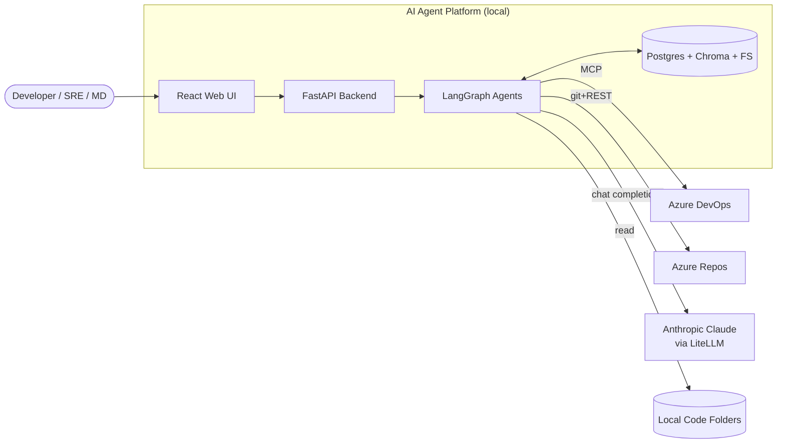

---

## 3. High-Level Architecture (C4 — Level 2)

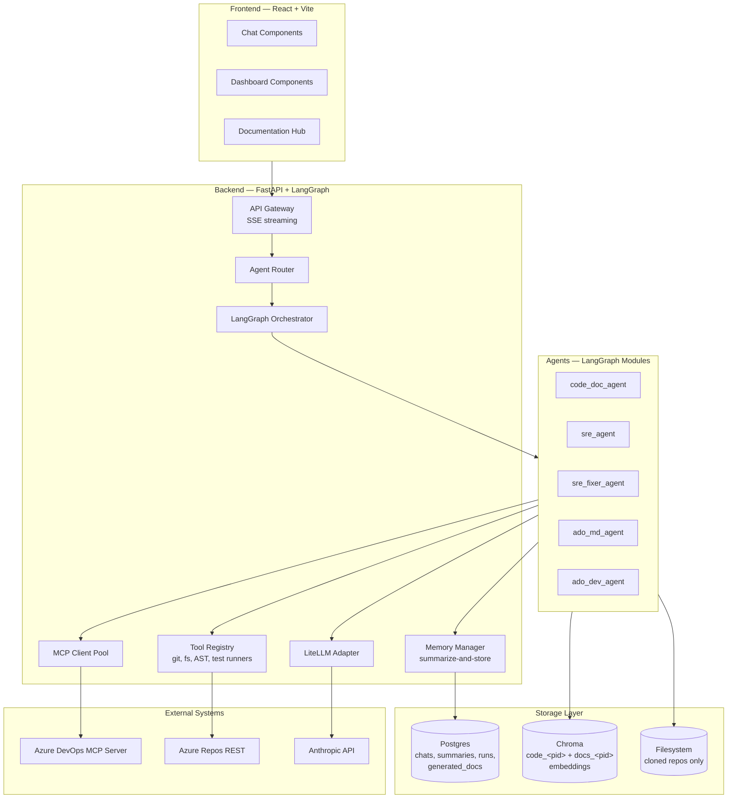

---

## 4. Tech Stack — Locked

| Layer | Choice | Rationale |
|---|---|---|
| Frontend | **React 18 + TypeScript + Vite** | Largest ecosystem, best chat/dashboard component support, fast HMR dev loop |
| UI styling | **Tailwind CSS + shadcn/ui** (Radix primitives) | Copy-in accessible components, full control over a clean **light/white theme** |
| Client state / data | **TanStack Query** (server cache) + **Zustand** (UI state) + **React Router** | Caching/refetch for dashboards, lightweight global state, hash/path routing |
| Markdown / diagrams (FE) | **react-markdown** + remark-gfm + **rehype-sanitize**, **mermaid** | Render generated docs + Mermaid diagrams safely in the Documentation Hub |
| Backend | **FastAPI** (async, SSE-friendly) | Best Python framework for agent streaming |
| Agent runtime | **LangGraph** | Stateful, durable, checkpointable graphs |
| LLM abstraction | **LiteLLM** | Provider-agnostic; swap Anthropic <-> Azure OpenAI <-> Ollama via config |
| Default model | **Anthropic Claude (claude-opus-4-7 / claude-sonnet-4-6)** | User confirmed |
| Vector DB | **Chroma** (local persisted mode) | POC simplicity |
| Relational DB | **SQLite (file-based at `Code/aiagent.db`) by default; Postgres 16 optional via `DATABASE_URL`** | v0.2: zero-config default — schema auto-created at startup (`shared/storage/schema.py`), persists across restarts. Postgres-only SQL (`now()`, `CAST … AS JSONB`, `NULLS LAST`) is rewritten for SQLite by `portable_sql()` and timestamps normalized by `iso_ts()` in `shared/storage/db.py`. Stores chat summaries, tree-graphs, generated docs, run metadata |
| Code parsing | **tree-sitter** (java, javascript, typescript, tsx) | Deterministic AST coverage |
| Graph storage | **NetworkX** in-memory + JSON persistence | Code tree-graph |
| MCP client | **mcp** Python SDK | For ADO MCP integration |
| Test runners | `mvn test`, `npm test` (subprocess) | SRE Fixer pre-PR validation |
| Git ops | **GitPython** + Azure DevOps REST | PR creation |
| Diagrams | **Mermaid** (text-native, renderable in markdown + Confluence) | User confirmed |
| HTML export | **markdown-it-py** + Confluence storage format converter | User requested confluence-compatible HTML |
| Packaging | **uv** or **pip** with `pyproject.toml` per agent | Standalone exportable |

---

## 5. Repository Structure (Monorepo)

```
AIAgentPlatform/Code/
├── frontend/                        # React 18 + Vite + TS app (white theme)
│   ├── src/
│   │   ├── components/
│   │   │   ├── ui/                  # shadcn/ui primitives (button, card, dialog, ...)
│   │   │   ├── chat/
│   │   │   │   ├── ChatPanel.tsx    # SSE streaming chat (replaces chat-widget.ts)
│   │   │   │   ├── MessageBubble.tsx
│   │   │   │   └── MarkdownView.tsx # react-markdown + mermaid (replaces markdown-render.ts)
│   │   │   ├── dashboard/           # cards, heatmap, tables
│   │   │   └── docs/                # Documentation Hub (see §13A)
│   │   │       ├── DocTree.tsx      # project → document tree sidebar
│   │   │       ├── DocViewer.tsx    # renders selected markdown/HTML doc
│   │   │       └── DocToolbar.tsx   # format toggle (MD/Confluence), download, search
│   │   ├── pages/
│   │   │   ├── HomePage.tsx         # agent picker
│   │   │   ├── CodeDocPage.tsx
│   │   │   ├── DocsPage.tsx         # Documentation Hub route (NEW)
│   │   │   ├── SrePage.tsx
│   │   │   ├── MdDashboardPage.tsx
│   │   │   └── DevPage.tsx
│   │   ├── layouts/
│   │   │   └── AppShell.tsx         # top nav + sidebar (replaces app-shell.ts)
│   │   ├── lib/
│   │   │   ├── api-client.ts        # fetch + SSE reader (ported from current Lit client)
│   │   │   ├── sse.ts               # async-generator SSE helper (POST + ReadableStream)
│   │   │   └── queryKeys.ts         # TanStack Query keys
│   │   ├── hooks/                   # useChatStream, useDocs, useMdDashboard, ...
│   │   ├── store/                   # Zustand UI state (theme, active project)
│   │   ├── styles/
│   │   │   └── theme.css            # Tailwind layer + white-theme CSS variables
│   │   ├── App.tsx                  # router + providers
│   │   └── main.tsx
│   ├── index.html
│   ├── tailwind.config.ts
│   ├── postcss.config.js
│   ├── components.json              # shadcn/ui config
│   ├── tsconfig.json
│   ├── vite.config.ts              # dev proxy /agents,/dashboards,/conversations → :8000
│   └── package.json
│
├── backend/                         # FastAPI gateway
│   ├── app/
│   │   ├── main.py
│   │   ├── routers/
│   │   │   ├── chat.py              # SSE streaming chat endpoint
│   │   │   ├── agents.py            # Agent invocation
│   │   │   └── dashboards.py
│   │   ├── services/
│   │   │   ├── memory.py            # Conversation summarizer
│   │   │   ├── llm_adapter.py       # LiteLLM wrapper
│   │   │   └── mcp_pool.py
│   │   └── db/
│   │       ├── models.py            # SQLAlchemy
│   │       └── migrations/          # Alembic
│   └── pyproject.toml
│
├── agents/                          # Standalone exportable agents
│   ├── code_doc_agent/
│   │   ├── graph.py                 # LangGraph StateGraph
│   │   ├── nodes/
│   │   │   ├── ingest.py
│   │   │   ├── ast_extract.py
│   │   │   ├── tree_graph.py
│   │   │   ├── semantic_pass.py
│   │   │   ├── cross_file.py
│   │   │   ├── doc_gen.py
│   │   │   └── verify.py
│   │   ├── tools/
│   │   │   ├── treesitter_tools.py
│   │   │   ├── fs_tools.py
│   │   │   └── mermaid_tools.py
│   │   ├── prompts/                 # .md prompt files
│   │   ├── config.yaml              # model, paths, thresholds
│   │   ├── __main__.py              # CLI entry: python -m code_doc_agent
│   │   ├── langgraph.json           # langgraph dev manifest
│   │   ├── pyproject.toml
│   │   └── README.md
│   ├── sre_agent/
│   ├── sre_fixer_agent/
│   ├── ado_md_agent/
│   └── ado_dev_agent/
│
├── shared/                          # Shared libs (installed by each agent)
│   ├── llm_adapter/                 # LiteLLM wrapper
│   ├── memory/                      # Summarizer + checkpointer
│   ├── mcp_client/
│   └── storage/                     # Chroma + Postgres helpers
│
├── infra/
│   ├── docker-compose.yml           # postgres, chroma, optional ollama
│   └── seed/
│
└── README.md
```

**Why this layout works for "standalone agent files":** each `agents/<name>/` folder is a self-contained Python package. A developer copies the folder, runs `uv sync`, configures `config.yaml`, and runs `python -m <agent_name>` — no dependency on the website backend.

---

## 6. LLM Adapter Design (LiteLLM)

```yaml
# config.yaml (per agent)
llm:
  provider: anthropic              # anthropic | azure_openai | openai | ollama | bedrock
  model: claude-opus-4-7
  temperature: 0.2
  max_tokens: 4096
  api_key_env: ANTHROPIC_API_KEY
  fallback:
    provider: ollama
    model: llama3.1:70b
    base_url: http://localhost:11434
```

```python
# shared/llm_adapter/client.py
from litellm import acompletion

class LLMAdapter:
    def __init__(self, cfg: dict): ...
    async def chat(self, messages, tools=None, stream=False):
        try:
            return await acompletion(model=f"{self.cfg.provider}/{self.cfg.model}", ...)
        except Exception:
            if self.cfg.fallback:
                return await acompletion(model=fallback_str, ...)
            raise
```

A single env-driven swap takes a developer from Anthropic to Ollama with no code change.

---

## 7. Conversation Memory Strategy (Summarize-only Exposure)

Per decision: **store summaries, expose only summaries to the LLM.** Implementation:

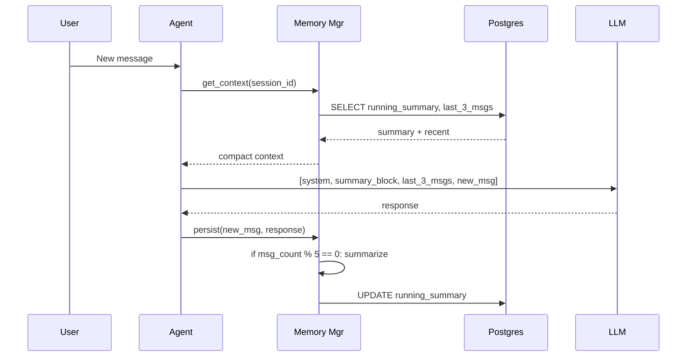

**Postgres schema:**

```sql
CREATE TABLE conversations (
  id UUID PRIMARY KEY,
  agent_name TEXT NOT NULL,
  scope_key TEXT,                    -- e.g., codebase_id for code_doc_agent
  user_id TEXT,
  created_at TIMESTAMPTZ DEFAULT now()
);

CREATE TABLE conversation_summaries (
  conversation_id UUID PRIMARY KEY REFERENCES conversations(id),
  running_summary TEXT,
  message_count INT DEFAULT 0,
  last_summarized_at TIMESTAMPTZ,
  updated_at TIMESTAMPTZ DEFAULT now()
);

CREATE TABLE recent_messages (
  id BIGSERIAL PRIMARY KEY,
  conversation_id UUID REFERENCES conversations(id),
  role TEXT,
  content TEXT,
  created_at TIMESTAMPTZ DEFAULT now()
);

CREATE INDEX ON recent_messages (conversation_id, created_at DESC);
```

A nightly job trims `recent_messages` to last 20 per conversation.

---

## 8. Agent #1 — Code Documentation Agent

### 8.1 Goal
Exhaustive, citation-backed documentation for Java + React codebases. Zero file/logic skipped. Output as Markdown + Confluence HTML in `<project>/.docs/`.

### 8.2 LangGraph State Schema

```python
class CodeDocState(TypedDict):
    project_path: str
    project_id: str
    mode: Literal["full", "incremental"]
    file_inventory: list[FileMeta]
    tree_graph: dict
    file_summaries: dict[str, FileSummary]
    module_clusters: list[Module]
    call_graph: dict
    flows: list[Flow]
    artifacts: dict[str, str]
    coverage_report: CoverageReport
    errors: list[str]
```

### 8.3 Graph Topology

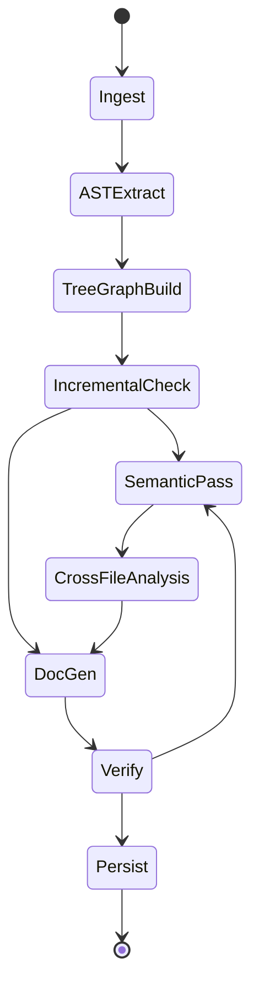

### 8.4 Node Responsibilities

| Node | Responsibility | Token Cost |
|---|---|---|
| **Ingest** | Walk folder, classify files (`.java`, `.jsx`, `.tsx`, `.ts`, `.js`), compute SHA-256 per file, persist `code_files` rows | 0 |
| **ASTExtract** | tree-sitter parse, extract classes, methods, imports, JSX components, hooks, props | 0 |
| **TreeGraphBuild** | Build NetworkX graph: project->package->file->class->method. Persist as JSON. **Token-saving artifact** passed to LLM as compact JSON instead of raw code | 0 |
| **IncrementalCheck** | Compare file hashes against `code_files.last_hash`. Mark dirty set | 0 |
| **SemanticPass** | For each file in dirty set: pass AST skeleton + chunked code -> LLM -> produce `FileSummary{purpose, business_rules[], dependencies[], edge_cases[]}`. Each rule cites `file:line` | High |
| **CrossFileAnalysis** | Resolve call edges across files; identify entry points; trace flows entry->DB | Medium |
| **DocGen** | Render the document set (Markdown + Mermaid blocks) **in memory** — no disk writes (v0.2 change) | Medium |
| **Verify** | Assert: every file has a summary; every summary cites lines; every public method appears in at least one flow OR is flagged "unreferenced". On failure -> loop back to SemanticPass with gap list | Low |
| **Persist** | **(v0.2)** Upsert each generated document's **markdown** into Postgres (`generated_docs`); chunk + embed the documents into Chroma collection `docs_<project_id>`; keep embedding per-file summaries into `code_<project_id>`; update `code_projects.last_indexed`. **No `.docs/` files written.** Confluence HTML is rendered on demand from the stored markdown (§13A) | 0 |

### 8.5 Generated Documents

The agent generates **8 documents** (the original 6 plus API surface and batch jobs). As of v0.2 each is identified by a stable `doc_id` (the old filename stem) and stored as **markdown in Postgres** (`generated_docs`), not as files on disk:

| doc_id | Title | Audience | Mermaid Diagrams |
|---|---|---|---|
| `01_management_overview` | Management Overview | MD/non-technical | High-level system diagram |
| `02_architecture` | Architecture | Architects | Component, deployment |
| `03_data_model` | Data Model | Devs | ER diagram (JPA / Mongoose / Prisma / typed models) |
| `04_flows` | Flows | Devs | Flow diagrams per entry point |
| `05_sequence_diagrams` | Sequence Diagrams | Devs | One per major use case |
| `06_business_logic` | Business Logic | BAs / Devs | Rule table with file:line citations |
| `07_api_surface` | API Surface | Devs | Endpoint + DTO catalog |
| `08_batch_jobs` | Batch Jobs & Scheduled Tasks | Devs / SRE | Job schedule table |

> The `doc_id` set is open-ended — new generators (`09_*`, …) appear automatically in the Documentation Hub because the UI lists whatever rows exist in `generated_docs` for the project. Confluence storage-format HTML is **rendered on demand** from the stored markdown (§13A.5), not persisted.

### 8.6 Incremental Mode (User-Triggered)

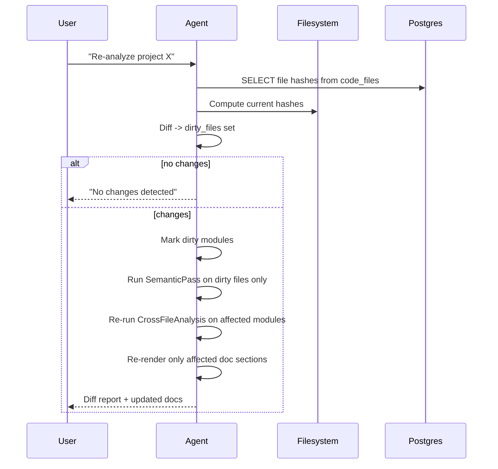

### 8.7 Coverage Guarantee Mechanism

The "shouldn't miss a single line" requirement is enforced in the **Verify** node:

```python
def verify(state):
    gaps = []
    for f in state.file_inventory:
        if f.path not in state.file_summaries:
            gaps.append(("missing_summary", f.path))
        else:
            summary = state.file_summaries[f.path]
            ast_methods = state.tree_graph.methods_for(f.path)
            covered = {r.cited_method for r in summary.business_rules}
            uncovered = set(ast_methods) - covered - summary.trivial_methods
            if uncovered:
                gaps.append(("uncovered_methods", f.path, uncovered))
    if gaps:
        return {"errors": gaps, "next": "SemanticPass"}
    return {"next": "Persist"}
```

Loop bound: max 3 iterations to prevent runaway costs; remaining gaps logged in `coverage_report`.

---

## 9. Agent #2 — SRE Agent

> **v0.3 rework:** The SRE Agent evolves from a **single-shot classifier** (one RAG query → one LLM verdict) into an **agentic investigator** that reasons, calls tools, gathers evidence, and revises hypotheses in a loop — the same way a human SRE (or this coding agent) actually works through an incident. The existing `intake → rag_search → classify` nodes remain the *entry* of the flow; the new core is an **investigation loop** between grounding and verdict. See [§9.15](#915-implementation-delta-vs-the-shipped-single-shot-agent) for the implementation delta against the code shipped today.

### 9.1 Goal
Triage user-reported issues against the generated docs + indexed code (from Agent #1) and reach an **evidence-backed verdict** — **Bug**, **Not-a-bug**, **Needs-info**, or **External** — with a root-cause narrative, `file:line` / `doc_id` / commit citations, and a confidence score. On a confirmed bug, hand a structured **bug packet** to the SRE Fixer (Agent #3) so it does not have to re-investigate.

### 9.2 Design principle — investigate like an agent, not a classifier

A single LLM call over a handful of RAG snippets can *label* an issue, but it cannot *explain* one: it never reads the failing code, never follows the stack trace, never checks what changed. Real triage is **iterative and evidence-driven**. This agent mirrors the loop a developer runs:

1. **Understand** the symptom — error signature, component, environment.
2. **Ground** it in what the system is *supposed* to do — docs + code summaries.
3. **Hypothesize** a ranked set of candidate root causes (differential diagnosis).
4. **Investigate** — for the leading hypothesis, pick the one tool call that would best confirm or refute it, observe, update beliefs. Repeat.
5. **Reflect** after each observation: confident enough to conclude? missing a fact only the user has? out of budget?
6. **Conclude** with a verdict, confidence, and a chain of cited evidence.
7. **Recommend** the next step and, for bugs, emit the handoff packet.

The investigation phase is a **ReAct loop** (reason → act → observe → reflect), not a fixed pipeline: the agent decides *what to look at next* from what it just found — exactly as this assistant does when debugging.

### 9.3 Inputs
- **Manual paste** in chat (error message, stack trace, repro steps, environment) — streamed triage.
- **CSV upload** (batch triage — rows: `id, title, description, stack_trace, env`), each row run through the same loop under a tighter budget ([§9.14](#914-csv--batch-mode)).

### 9.4 LangGraph State Schema

Extends the shipped `SREState` / `Verdict` with the working memory an investigation needs — hypotheses, an evidence ledger, the ReAct trace, and a budget:

```python
class IssueFacts(BaseModel):           # normalized from the raw report
    error_signature: str               # e.g. "NullPointerException @ OrderService.price:142"
    exception_type: str | None
    failing_frames: list[Frame]        # parsed stack frames -> relative_path:line
    component: str | None              # suspected module / area
    environment: str | None
    symptoms: list[str]

class Hypothesis(BaseModel):
    id: str
    statement: str                     # "order is null on cache miss; repo returns empty"
    prior: float                       # initial plausibility 0..1
    posterior: float                   # updated as evidence arrives
    status: Literal["open", "supported", "refuted"]
    supporting: list[str]              # evidence ids
    refuting: list[str]

class Evidence(BaseModel):
    id: str
    source: Literal["code", "doc", "git", "callgraph", "flow", "similar_issue", "user"]
    citation: str                      # "OrderService.java:142" | "doc:04_flows#checkout" | "commit abc123"
    finding: str                       # what it shows
    bears_on: list[str]                # hypothesis ids it supports / refutes

class InvestigationStep(BaseModel):    # one ReAct turn (for the SSE trace + audit)
    n: int
    thought: str
    action: str                        # tool name + args
    observation: str

class Budget(BaseModel):
    max_steps: int = 8                 # investigation iterations
    max_tool_calls: int = 16
    max_tokens: int = 60_000
    used_steps: int = 0
    used_tool_calls: int = 0

class SREState(TypedDict, total=False):
    project_id: str
    issue: dict                        # IssueIntake (unchanged)
    facts: dict                        # IssueFacts            (new)
    hypotheses: list[dict]             # list[Hypothesis]      (new)
    evidence: list[dict]               # list[Evidence]        (new)
    investigation_log: list[dict]      # list[InvestigationStep] (new)
    budget: dict                       # Budget                (new)
    rag_hits: list[dict]
    classification_history: list[dict]
    verdict: dict                      # Verdict, now carries root_cause + citations
    followup_round: int
    user_message: str
    messages: list[dict]
    handoff: dict | None               # bug packet for SRE Fixer
```

### 9.5 Investigation graph (the agentic loop)

```mermaid
stateDiagram-v2
    [*] --> Understand
    Understand --> Ground
    Ground --> Hypothesize
    Hypothesize --> Investigate

    state Investigate {
        [*] --> Plan
        Plan --> Act : pick the tool that best reduces uncertainty
        Act --> Observe
        Observe --> Reflect : record evidence; re-score hypotheses
        Reflect --> Plan : gap remains AND budget left
        Reflect --> [*] : confident OR budget spent OR needs user
    }

    Investigate --> Conclude : confident / budget spent
    Investigate --> AskFollowUp : a user-only fact blocks the verdict
    AskFollowUp --> Understand : user replies (new round)
    Conclude --> HandoffFixer : bug & confidence >= threshold
    Conclude --> CloseNotBug : not_a_bug & confidence >= threshold
    Conclude --> AskFollowUp : needs_more_info
    HandoffFixer --> [*]
    CloseNotBug --> [*]
```

`Understand` and `Ground` correspond to the existing `intake` and `rag_search` nodes; `Conclude` is the existing `classify` decision, now fed by an evidence ledger instead of raw snippets alone.

### 9.6 The investigation loop, phase by phase

| Phase | What it does | Mirrors (how a dev works) |
|---|---|---|
| **Understand** | Normalize the raw report into `IssueFacts`: extract the exception type + message, parse the stack trace into ordered `file:line` frames, infer the affected component and environment | "Read the error and the stack trace first" |
| **Ground** | Retrieve from **both** Chroma collections — `docs_<pid>` (flows, business logic, sequence diagrams) and `code_<pid>` (per-file summaries) — to learn what the implicated area is *supposed* to do | "What does this part of the system do?" |
| **Hypothesize** | Generate a ranked list of candidate root causes with priors; cheap to enumerate, expensive to confirm — so rank them | Differential diagnosis |
| **Plan** | For the leading open hypothesis, choose the single tool call whose result would most change its posterior (read the cited line? blame it? check the caller?) | "What's the fastest thing that tells me if I'm right?" |
| **Act** | Execute one tool ([§9.7](#97-tool-registry-expanded)), bounded by the path / command guards in §17 | Run the command / open the file |
| **Observe** | Record an `Evidence` row with a citation and what it shows | Read the output |
| **Reflect** | Re-score hypotheses (support / refute), prune refuted ones, possibly spawn a new one; decide stop-or-continue ([§9.9](#99-reasonactobservereflect-cycle-stopping--budget)) | "Does this confirm it, or do I keep digging?" |
| **Conclude** | Synthesize the surviving hypothesis into a root-cause narrative; emit verdict + confidence + citations | Write up the root cause |

### 9.7 Tool registry (expanded)

The investigator's tools mirror what this assistant reaches for. Several already exist in [tools/rag.py](Code/agents/sre_agent/tools/rag.py) but are **defined-yet-unused** by the current single-shot flow — the loop finally wires them in.

| Tool | Purpose | Status today |
|---|---|---|
| `search_code_docs(query, pid)` | Similarity search; **extended to query `docs_<pid>` + `code_<pid>`** and merge / de-dupe | exists (code-only) — extend |
| `get_doc(pid, doc_id)` | Pull a full generated document (e.g. `04_flows`) from `generated_docs` for the affected path | new (reuse `DocService`, §13A.5) |
| `parse_stack_trace(text)` | Split a stack trace into ordered frames, resolve each to `relative_path:line` | new |
| `fetch_code_snippet(file, line_range)` | Read the actual source at a cited location (path-guarded) | exists — wire in |
| `get_business_rules(module)` | Persisted rules + edge cases for a file (Agent #1 output) | exists — wire in |
| `get_call_graph(symbol)` | Callers / callees of the failing method from Agent #1's NetworkX tree-graph | new |
| `get_flow(entry_point)` | The traced entry→DB flow for the affected path (from `04_flows`) | new |
| `git_blame(file, line_range)` | Last change + author + commit for the suspect lines | new (GitPython) |
| `git_log_recent(path, since)` | Recent commits touching the area — regression hunting | new (GitPython) |
| `find_similar_issues(signature)` | Prior triaged issues with the same error signature + their verdicts | new (persisted verdicts) |
| `grep_code(pattern)` | Literal / regex search across the repo for a symbol or string | new |

All tool inputs derived from the issue text are treated as **untrusted** (§17): code / stack content is isolated in user-role blocks, never the system prompt; `fetch_code_snippet` / `grep_code` are confined to the project root; git tools are read-only.

### 9.8 Hypothesis tracking (differential diagnosis)

The agent keeps an explicit, ranked hypothesis board and updates it as evidence lands — this is what turns a guess into a diagnosis:

| H | Statement | Prior | After evidence | Status |
|---|---|---|---|---|
| H1 | `order` is null on cache miss; repo returns empty | 0.45 | 0.86 — blame shows cache path added last week, no null guard | **supported** |
| H2 | Race between cache write and read | 0.30 | 0.10 — single-threaded path per `04_flows` | refuted |
| H3 | Bad input from controller (missing id) | 0.25 | 0.15 — controller validates id is present | refuted |

When the top hypothesis's posterior clears the confidence threshold and no open rival is close, the loop stops and concludes. If two stay close, that itself is the finding → ask a disambiguating follow-up.

### 9.9 Reason→act→observe→reflect cycle, stopping & budget

```mermaid
sequenceDiagram
    participant A as SRE Agent (reasoner)
    participant T as Tool Registry
    participant L as LLM
    loop until a stop condition holds
        A->>L: Thought — which hypothesis, which tool?
        L-->>A: pick tool + args
        A->>T: Act — call tool (read line / blame / callgraph / ...)
        T-->>A: Observation
        A->>A: record Evidence; re-score hypotheses
        A->>L: Reflect — confident? need user? budget left?
    end
    A->>A: Conclude — verdict + confidence + citations
```

**Stop when any holds:**
- **Confident** — leading hypothesis posterior ≥ `confidence_threshold` (config, default 0.7) and no rival within 0.15.
- **Needs user** — a single missing fact only the reporter has would flip the verdict → `AskFollowUp`.
- **Budget spent** — `max_steps` / `max_tool_calls` / `max_tokens` exhausted → conclude best-effort, mark confidence honestly, attach the gap.
- **No new evidence** — the last step changed no posterior → stop digging (avoid loops), conclude or ask.

Budget exhaustion never fabricates certainty: it returns the strongest *supported* hypothesis with its real (often lower) confidence and the open questions, plus the full `investigation_log`.

### 9.10 Worked example (a ReAct trace)

> Issue: *"`NullPointerException` in checkout, prod, intermittent"* — pasted with a stack trace.

```
Understand  signature = NPE @ OrderService.price:142; frames -> OrderService.java:142,
            CheckoutController.java:88; component = checkout; env = prod
Ground      docs_<pid> -> 04_flows#checkout, 06_business_logic (pricing rules);
            code_<pid> -> OrderService summary ("prices an order; reads Order from repo")
Hypothesize H1 order null on cache miss (0.45) · H2 race (0.30) · H3 bad input (0.25)

Step 1  Thought: H1 — read the failing line.
        Action: fetch_code_snippet(OrderService.java, 138-150)
        Observation: `return order.getTotal()...` — `order` from `cache.get(id)`, no null check.
        => Evidence E1 (code, OrderService.java:142) SUPPORTS H1.

Step 2  Thought: when did this null path appear?
        Action: git_blame(OrderService.java, 138-150)
        Observation: lines 140-143 changed 6 days ago, commit abc123 "add order cache".
        => Evidence E2 (git, commit abc123) SUPPORTS H1 (regression).

Step 3  Thought: rule out H2 — is the checkout path concurrent?
        Action: get_flow("checkout")
        Observation: single synchronous request flow; no shared mutable cache writer.
        => Evidence E3 REFUTES H2.

Step 4  Thought: rule out H3 — does the controller guarantee a valid id?
        Action: fetch_code_snippet(CheckoutController.java, 80-95)
        Observation: id validated non-null before the call.
        => Evidence E4 REFUTES H3.

Reflect  H1 posterior 0.88; rivals refuted; budget fine -> stop.
Conclude verdict = bug, confidence 0.88,
         root_cause = "commit abc123 added a cache read without a null guard; on cache
         miss `cache.get(id)` returns null and OrderService.price NPEs (line 142)."
         citations = [OrderService.java:142, commit abc123, doc:04_flows#checkout]
         next_step = hand off to SRE Fixer.
```

This is the same shape as the assistant's own debugging narration: a thought, one targeted action, an observation, and a belief update — repeated until the cause is cornered.

### 9.11 Verdict & evidence output

The `Verdict` (extends the shipped model) now carries the investigation, not just a label:

```python
class Verdict(BaseModel):
    classification: Literal["bug", "not_a_bug", "needs_more_info", "external"]
    confidence: float
    root_cause: str                    # narrative tied to the evidence ledger
    rationale: str
    citations: list[str]               # file:line / doc_id / commit — every claim grounded
    likely_files: list[str]
    suggested_owner: str | None
    next_step: str
    questions: list[str]               # only when needs_more_info
    investigation_log: list[dict]      # the ReAct trace, for audit + UI replay
```

`not_a_bug` is sub-typed in `rationale` (expected-by-design / configuration / user-error / external-dependency); `external` routes to the owning team rather than the Fixer.

### 9.12 Handoff packet to SRE Fixer

A confirmed bug emits a packet rich enough that Agent #3 starts at *PlanFix*, not re-investigation (it slots into `ContextLoad`, §10.2):

```jsonc
{
  "project_id": "...",
  "issue": { /* IssueIntake */ },
  "root_cause": "cache read without null guard (regression in abc123)",
  "suspect_locations": ["OrderService.java:142"],
  "regression_commit": "abc123",
  "evidence": [ /* cited Evidence ledger */ ],
  "suggested_fix_area": "null-guard the cache.get(id) miss; fall back to repo load",
  "repro": "checkout an order whose cache entry expired",
  "confidence": 0.88,
  "conversation_link": "/conversations/<id>"
}
```

### 9.13 Streaming the investigation (SSE)

Triage runs over the existing `POST /agents/sre/triage` (SSE) endpoint (§14). Each `InvestigationStep` is streamed as it happens — `thought`, `action`, `observation`, hypothesis-board deltas — so the user watches the agent reason and can interrupt, exactly like this assistant's live tool trace. The final event carries the `Verdict` (+ handoff packet for bugs). Event types extend the existing `SreEvent` union (§13.4): `step`, `hypothesis`, `evidence`, `verdict`.

### 9.14 CSV / batch mode

Each row runs the **same loop** under a tighter budget (e.g. `max_steps: 3`; doc / code RAG + stack-trace read only; git / callgraph tools off by default) so a 500-row backlog stays affordable. Output is an enriched CSV: `verdict, confidence, root_cause, related_files, regression_commit, suggested_owner, next_step, conversation_link`. Rows that hit budget without confidence are emitted as `needs_more_info` with their open questions — never as false certainty.

### 9.15 Implementation delta vs the shipped single-shot agent

What exists today ([graph.py](Code/agents/sre_agent/graph.py)): `intake → rag_search → classify → {handoff_fixer | close_not_bug | ask_followup}`, where `rag_search` issues one `code_<pid>` query and `classify` makes one LLM call; the follow-up "loop" is the FastAPI layer re-invoking the whole graph. The agentic upgrade is **additive**:

| Change | Where |
|---|---|
| Parse the stack trace into `IssueFacts` during understanding | extend `intake_node` |
| `rag_search` queries **both** `docs_<pid>` + `code_<pid>` and merges | `nodes/rag_search.py` + `tools/rag.py` (mirrors §13A.5) |
| New `hypothesize` + `investigate` nodes implementing the ReAct loop with a tool-dispatch table | `nodes/investigate.py` (new) |
| Wire the **already-defined** `fetch_code_snippet` / `get_business_rules`; add `get_call_graph`, `get_flow`, `git_blame`, `git_log_recent`, `find_similar_issues`, `grep_code` | `tools/` |
| `classify` consumes the evidence ledger; `Verdict` gains `root_cause` + `citations` + `investigation_log`; add the `external` class | `nodes/classify.py`, `state.py` |
| Budget + stop-condition controller | config `sre.budget.*` + loop guard |
| Stream `step` / `hypothesis` / `evidence` events | backend SSE router |

The graph's outer shape (entry → … → verdict → handoff / close / ask) and the existing config knobs (`confidence_threshold`, `max_followup_rounds`, `csv_max_rows`) are preserved.

### 9.16 Why this mirrors an agent's analysis
- **Hypothesis-driven, not label-driven** — it forms and tests competing explanations instead of pattern-matching to a class.
- **Evidence before verdict** — every claim cites `file:line` / `doc_id` / commit; the confidence is earned, not asserted.
- **Tool-using and adaptive** — it reads the actual code, follows the trace, and checks git history, choosing each next action from the last observation.
- **Knows when to stop or ask** — confidence, budget, and "no new evidence" gates prevent both premature verdicts and runaway loops.
- **Hands off, doesn't dead-end** — the bug packet lets the Fixer act immediately, and the streamed trace makes the whole diagnosis auditable.

---

## 10. Agent #3 — SRE Fixer Agent

### 10.1 Goal
On confirmed bug from SRE Agent: produce a patch, run tests, open a PR to **a separate fix branch in Azure Repos** (no auto-merge).

### 10.2 Graph

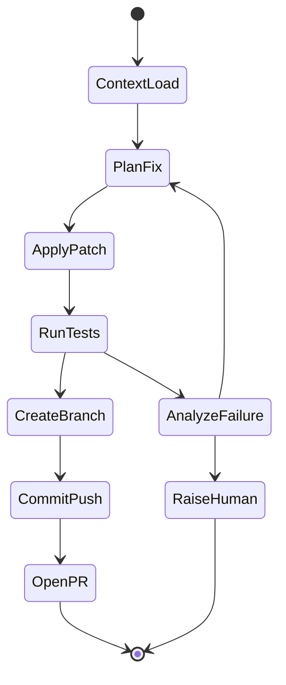

### 10.3 Tools

| Tool | Purpose |
|---|---|
| `git_create_branch(repo, name)` | Branch off main: `fix/sre-<conv_id>-<short_desc>` |
| `apply_patch(file, diff)` | Write changes |
| `run_tests(cmd, cwd)` | Subprocess `mvn test` / `npm test` with timeout, capture stdout/stderr |
| `git_commit_push(repo, msg)` | Conventional commit message with SRE conv ID |
| `azure_repos_create_pr(...)` | Azure DevOps REST API — title, description (incl. SRE conv link), reviewers (from CODEOWNERS or config) |

### 10.4 PR Template

```
[Auto-fix] <Issue Title>

## Root cause
<from SRE agent verdict>

## Changes
<file-level summary>

## Tests
- PASS <test_suite_name> — N passed
- PASS <test_suite_name> — M passed

## Provenance
- SRE conversation: <link>
- Generated by: SRE Fixer Agent (LangGraph run <run_id>)

WARNING: Human review required — do not auto-merge.
```

### 10.5 Safety Rails (Even for POC)
- **Never push to `main`** — always to `fix/*` branch
- **Never `--force` push**
- **Never delete branches**
- Test failures bubble up to human after 3 retries; do not "give up and PR anyway"
- All file writes scoped to repo root (path traversal guard)

---

## 11. Agent #4 — ADO MD Personal Assistant

### 11.1 Goal
Dashboard for the MD covering 100M-portfolio squads: utilization, issues, RAID items, key achievements, attention areas.

### 11.2 Architecture — Scheduled Refresh + On-Demand Drill-Down

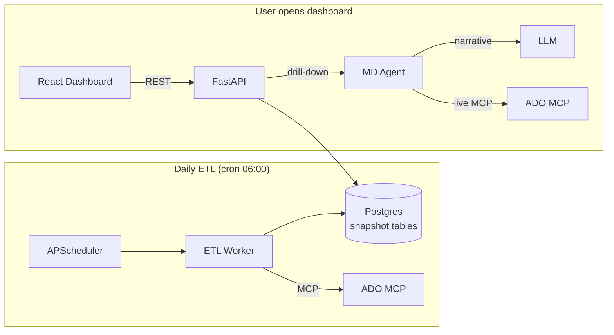

### 11.3 Snapshot Tables

```sql
CREATE TABLE squad_snapshot (
  snapshot_date DATE,
  squad_name TEXT,
  total_workitems INT,
  in_progress INT,
  done_this_sprint INT,
  blocked INT,
  overdue INT,
  velocity_3sprint_avg NUMERIC,
  utilization_pct NUMERIC,
  PRIMARY KEY (snapshot_date, squad_name)
);

CREATE TABLE raid_snapshot (
  snapshot_date DATE,
  squad_name TEXT,
  type TEXT,
  title TEXT,
  severity TEXT,
  owner TEXT,
  due_date DATE,
  workitem_id INT
);

CREATE TABLE key_achievement (
  snapshot_date DATE,
  squad_name TEXT,
  achievement TEXT,
  evidence_workitem_ids INT[]
);
```

### 11.4 Dashboard Sections
1. **Portfolio Heatmap** — squads x (velocity, utilization, blocked, overdue)
2. **Top Risks & Issues** — sorted by severity x proximity
3. **Key Achievements (week)** — LLM-summarized from completed workitems
4. **Attention Required** — auto-derived: any squad with overdue >= 3, velocity drop >20%, blocked >5
5. **Drill-down chat** — "Why is Squad X behind?" -> Agent calls live ADO MCP

---

## 12. Agent #5 — ADO Developer Personal Assistant

### 12.1 Goal
Per-developer ADO assistant: status reporting OR task updating. Remembers last areapath.

### 12.2 Graph

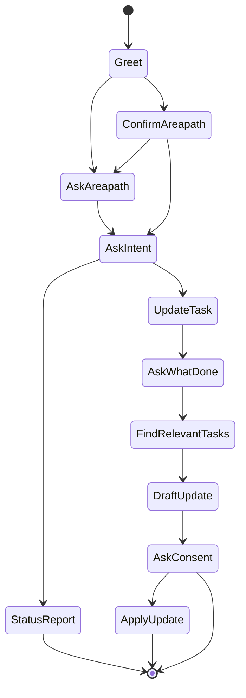

### 12.3 Persistent Preferences

```sql
CREATE TABLE user_preferences (
  user_id TEXT PRIMARY KEY,
  agent_name TEXT,
  last_areapath TEXT,
  last_iteration TEXT,
  preferences JSONB,
  updated_at TIMESTAMPTZ
);
```

### 12.4 Status Report Dashboard

| Section | Computation |
|---|---|
| **Assigned** | Count of `AssignedTo=@me` in areapath |
| **In Progress** | State = Active/Doing |
| **Overdue** | DueDate < today AND State != Done |
| **Planned this week** | TargetDate within current week |
| **Action needed** | Overdue list; Active tasks with no commits in 3+ days; Tasks where StartDate < today AND State = New |
| **Velocity** | Story points completed / sprint, last 3 sprints |
| **Sprint utilization** | Committed pts vs completed pts ratio |

### 12.5 Update Flow Detail

```
User: "I worked on the auth refactor and fixed the cookie bug today"
Agent -> ADO MCP: query workitems assigned to user with title/description containing "auth", "cookie"
Agent -> LLM: rank candidates by semantic match
Agent: "I found 2 matches:
        1. #4521 — Refactor auth middleware (Active)
        2. #4602 — Cookie expiry bug in /login (Active)
        Draft updates:
        #4521 -> 'Continued refactor; extracted token validation into separate module'
        #4602 -> 'Identified root cause (TZ mismatch); fix applied; ready for QA'
        Apply both? (yes/edit/no)"
User: yes
Agent -> ADO MCP: update both workitems with comments + state transitions
```

---

## 13. Frontend Architecture (React)

> **Migration note (v0.2):** The original Lit app is replaced by a React 18 + TypeScript + Vite SPA with Tailwind + shadcn/ui on a **white theme**. The backend contract is unchanged — the existing SSE/REST endpoints (and the TypeScript types already defined in `api-client.ts`) are reused verbatim. The migration is a frontend-only swap plus a small set of **new** backend doc-serving endpoints (§14) that power the Documentation Hub (§13A).

### 13.1 Stack & rationale

| Concern | Choice |
|---|---|
| Framework | React 18 + TypeScript |
| Build/dev | Vite (HMR, `server.proxy` to FastAPI `:8000`) |
| Styling | Tailwind CSS + shadcn/ui (Radix) — **light/white theme** |
| Routing | React Router v6 (`/`, `/code-doc`, `/docs`, `/sre`, `/md`, `/dev`) |
| Server cache | TanStack Query (projects, docs list, MD dashboard) |
| UI state | Zustand (active project, theme, sidebar) |
| Markdown | react-markdown + remark-gfm + rehype-sanitize |
| Diagrams | mermaid (rendered in a `MarkdownView` effect) |

### 13.2 White theme (design tokens)

Defined once as CSS variables in `styles/theme.css` and wired into `tailwind.config.ts` so shadcn components and custom components share them. This replaces the dark-palette CSS variables (`--panel`, `--accent`, etc.) currently in `styles.css`.

```css
:root {
  --background: 0 0% 100%;          /* white canvas */
  --surface:    210 20% 98%;        /* cards / panels — near-white */
  --surface-2:  214 32% 95%;        /* hover / selected rows */
  --border:     214 20% 88%;
  --foreground: 222 30% 12%;        /* near-black text */
  --muted:      215 16% 47%;
  --primary:    221 83% 53%;        /* accent blue — actions, active nav */
  --primary-foreground: 0 0% 100%;
  --success: 142 71% 40%;
  --warning: 38 92% 50%;
  --danger:  0 72% 51%;
  --radius: 0.6rem;
  --shadow-card: 0 1px 2px rgb(16 24 40 / 6%), 0 1px 3px rgb(16 24 40 / 4%);
}
```

Design language: white background, soft 1px borders, subtle card shadows (no heavy boxes), generous spacing, blue accent reserved for primary actions and active nav, color used semantically (success/warning/danger) only for status chips. Mermaid is initialized with `theme: "neutral"` (not `"dark"`) to match the white canvas.

### 13.3 Layout shell

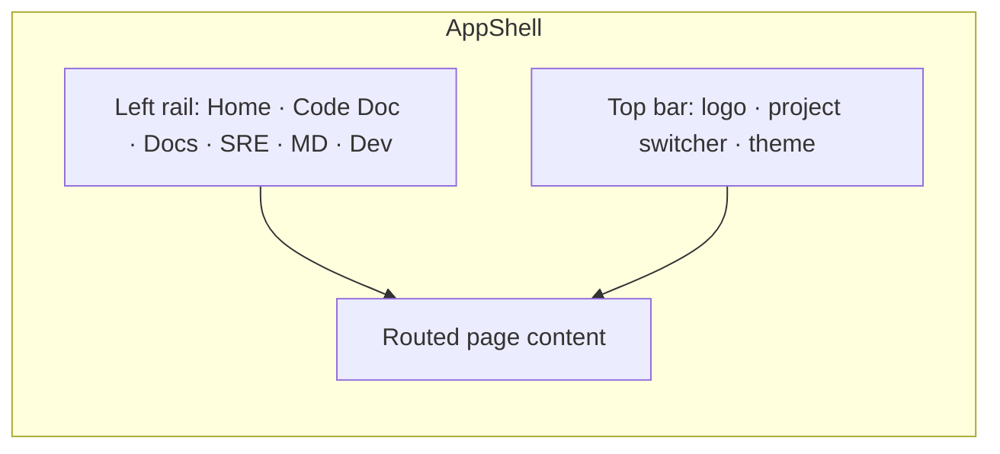

`AppShell.tsx` replaces `app-shell.ts`. Hash-based nav becomes React Router. The left rail is collapsible; the active route is highlighted with the `--primary` token.

### 13.4 Streaming pattern (ported, not redesigned)

The current client already POSTs JSON and reads `text/event-stream` via `fetch` + `ReadableStream` (because EventSource is GET-only). That logic moves to `lib/sse.ts` as a reusable async generator, consumed by a `useChatStream` hook:

```ts
// lib/sse.ts — ported from api-client.ts streamSse()
export async function* streamSse<T>(path: string, body: unknown, signal?: AbortSignal): AsyncGenerator<T> {
  const res = await fetch(path, {
    method: "POST",
    headers: { "content-type": "application/json", accept: "text/event-stream" },
    body: JSON.stringify(body),
    signal,
  });
  if (!res.ok || !res.body) throw new Error(`HTTP ${res.status}: ${await res.text()}`);
  const reader = res.body.getReader();
  const decoder = new TextDecoder();
  let buffer = "";
  while (true) {
    const { value, done } = await reader.read();
    if (done) break;
    buffer += decoder.decode(value, { stream: true });
    let idx;
    while ((idx = buffer.indexOf("\n\n")) >= 0) {
      const block = buffer.slice(0, idx);
      buffer = buffer.slice(idx + 2);
      const data = block.split("\n").find((l) => l.startsWith("data:"))?.slice(5).trim();
      if (data) { try { yield JSON.parse(data) as T; } catch { /* ignore */ } }
    }
  }
}
```

```ts
// hooks/useChatStream.ts
function useChatStream(agentId: string, scopeKey?: string) {
  const [messages, setMessages] = useState<Msg[]>([]);
  const [inflight, setInflight] = useState("");
  const convId = useRef<string>();
  const send = useCallback(async (text: string) => {
    setMessages(m => [...m, { role: "user", content: text }]);
    setInflight("");
    for await (const ev of streamSse<ChatEvent>(`/agents/${agentId}/chat`,
        { message: text, conversation_id: convId.current, scope_key: scopeKey })) {
      if (ev.type === "start") convId.current = ev.conversation_id;
      else if (ev.type === "token") setInflight(p => p + ev.delta);
      else if (ev.type === "final") { setMessages(m => [...m, { role: "assistant", content: ev.content }]); setInflight(""); }
      else if (ev.type === "error") setMessages(m => [...m, { role: "assistant", content: `Error: ${ev.message}` }]);
    }
  }, [agentId, scopeKey]);
  return { messages, inflight, send };
}
```

All existing event types (`ChatEvent`, `SreEvent`, `FixerEvent`, `MdDrillEvent`, `DevChatEvent`) and request/response interfaces in the current `api-client.ts` are reused unchanged.

### 13.5 Component → file mapping (Lit → React)

| Old (Lit) | New (React) | Notes |
|---|---|---|
| `app-shell.ts` | `layouts/AppShell.tsx` | hashchange → React Router |
| `chat-widget.ts` | `components/chat/ChatPanel.tsx` + `useChatStream` | streaming logic into hook |
| `markdown-render.ts` | `components/chat/MarkdownView.tsx` | marked+DOMPurify → react-markdown+rehype-sanitize; mermaid theme `neutral` |
| `home-page.ts` | `pages/HomePage.tsx` | agent cards (shadcn `Card`) |
| `code-doc-page.ts` | `pages/CodeDocPage.tsx` | project list via TanStack Query; **adds "View docs" link → Documentation Hub** |
| `sre-page.ts` | `pages/SrePage.tsx` | triage + CSV upload |
| `md-dashboard-page.ts` | `pages/MdDashboardPage.tsx` | heatmap/tables in shadcn `Table`/`Card` |
| `dev-page.ts` | `pages/DevPage.tsx` | status report + update consent flow |
| `api-client.ts` | `lib/api-client.ts` + `lib/sse.ts` | split transport from typed methods |
| — | `pages/DocsPage.tsx` + `components/docs/*` | **NEW** Documentation Hub |

---

## 13A. Documentation Hub + Project Chatbot (NEW)

### 13A.1 Requirement
> "Instead of saving the generated content as HTML, store the content in Postgres and the vector DB, and have a React screen to render it plus a chatbot to ask further questions about the project."

This is a **storage-model change**, not just a UI add-on. Today `doc_gen_node` ([doc_gen.py](Code/agents/code_doc_agent/nodes/doc_gen.py)) writes `.docs/markdown/*.md` **and** `.docs/confluence/*.html` to disk and returns filesystem paths in `artifacts`; `persist_node` ([persist.py](Code/agents/code_doc_agent/nodes/persist.py)) only embeds *per-file code summaries* into Chroma `code_<pid>` and bumps `last_indexed`. The generated documents themselves are **not** in any database. v0.2 changes that:

- **Postgres = source of truth for rendering** — full generated markdown per document.
- **Chroma = retrieval index for the chatbot** — the documents are chunked and embedded so the project chatbot can answer with citations.
- **No HTML/MD files on disk** — the `.docs/` writes are removed. Confluence HTML is produced on demand from the stored markdown when a user requests that format.

### 13A.2 Where storage changes

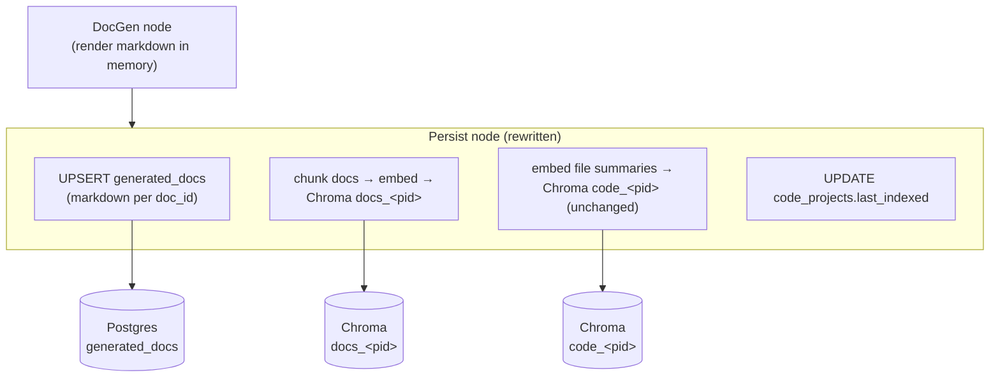

### 13A.3 Postgres schema (new)

```sql
CREATE TABLE generated_docs (
  project_id   TEXT NOT NULL REFERENCES code_projects(id) ON DELETE CASCADE,
  doc_id       TEXT NOT NULL,          -- e.g. '02_architecture'
  title        TEXT NOT NULL,          -- e.g. 'Architecture'
  audience     TEXT,                   -- 'management' | 'architecture' | 'developer'
  sort_order   INT  NOT NULL DEFAULT 0,
  content_md   TEXT NOT NULL,          -- full generated markdown (source of truth)
  content_hash TEXT NOT NULL,          -- sha256(content_md) for incremental skip
  generated_at TIMESTAMPTZ DEFAULT now(),
  PRIMARY KEY (project_id, doc_id)
);
CREATE INDEX ON generated_docs (project_id, sort_order);
```

Markdown (not HTML) is stored: it is the smallest faithful representation, renders natively in the React viewer, embeds cleanly for RAG, and converts to Confluence HTML on demand. The existing `code_projects` table is reused for project metadata + `last_indexed`.

### 13A.4 Chroma: documentation embeddings (new collection)

- New collection **`docs_<project_id>`**, separate from the existing **`code_<project_id>`** (per-file code summaries).
- The `Persist` node chunks each document (heading-aware, ~800–1000 tokens, small overlap), then `ChromaStore.upsert(...)` with:
  - `ids`: `f"{pid}::{doc_id}::{chunk_index}"`
  - `documents`: chunk text
  - `metadatas`: `{ project_id, doc_id, title, audience, heading_path, chunk_index }`
- Stable IDs make re-indexing idempotent (upsert overwrites a doc's chunks). On a `full` re-index the collection is reset for that project; on `incremental` only changed `doc_id`s are re-chunked.

### 13A.5 Backend — services & endpoints

**`DocService`** (new, `app/services/doc_service.py`) — reads/writes `generated_docs`:
- `list_docs(project_id)` → ordered `[{doc_id, title, audience, generated_at}]`.
- `get_doc(project_id, doc_id, format)` → `content_md`; if `format=confluence`, convert markdown → Confluence storage-format HTML on the fly (reuse `_to_confluence_html` from `doc_gen.py`, factored into `shared/` so both the agent and the API can call it).

**Endpoints** (in `app/routers/code_doc.py`):
| Method | Path | Returns |
|---|---|---|
| `GET` | `/agents/code_doc/projects/{id}/docs` | doc list (drives the tree) — 404 if `last_indexed` is null |
| `GET` | `/agents/code_doc/projects/{id}/docs/{doc_id}?format=markdown\|confluence` | one document's rendered content |

**Project chatbot** — reuses the existing SSE chat endpoint `POST /agents/code_doc/chat` with `scope_key = project_id`, but the retrieval node now queries **both** Chroma collections:

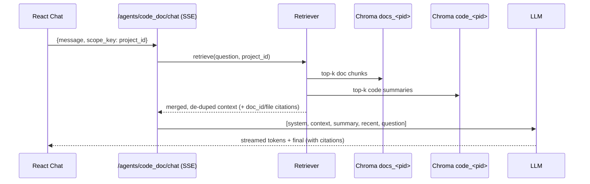

The chatbot answers from **generated docs + code summaries** and cites the `doc_id` (linkable into the Documentation Hub) and/or `file:line`.

### 13A.6 Frontend (React)
- **`DocsPage`** route `/docs` and `/docs/:projectId/:docId` — reachable from the left rail and a "View docs" action on each project in `CodeDocPage`.
- **`DocTree`** — project switcher → documents grouped by audience (Management / Architecture / Developer), driven by `GET …/docs` via TanStack Query.
- **`DocViewer`** — renders `content_md` through the shared `MarkdownView` (react-markdown + mermaid `neutral` theme), so diagrams/code look identical to chat.
- **`DocToolbar`** — Markdown ⟷ Confluence-HTML toggle (re-fetches with `?format=`), in-doc search, Copy/Download, `generated_at` timestamp, "Re-generate (incremental)" → `/index`.
- **`ProjectChat`** — a docked chat panel on `DocsPage` (and embedded in `CodeDocPage`) wired to `useChatStream("code_doc", projectId)`; citations render as links that select the corresponding `doc_id` in `DocViewer`.
- **Empty/stale states** — `last_indexed` null → "No documentation generated yet" + Generate CTA; source changed since `last_indexed` → "docs may be stale" banner.

### 13A.7 Migration & cleanup (agent side)
- **`doc_gen_node`**: drop the `os.makedirs` + `open(...).write(...)` blocks for `md_dir`/`html_dir`; return the in-memory `docs` dict (doc_id → markdown) in state instead of filesystem paths.
- **`persist_node`**: extend to upsert `generated_docs` and embed into `docs_<pid>` (in addition to the existing `code_<pid>` summary embeddings).
- Remove `storage.output_subdir` / `output_dir` from `config.yaml` (no longer writing files).
- Factor `_to_confluence_html` into `shared/` for on-demand conversion.
- **Standalone-agent note (§5):** because docs now live in Postgres+Chroma, a copied standalone agent needs `DATABASE_URL` + Chroma configured to view docs. An **optional** `--export-dir` CLI flag can still dump markdown files for fully-offline use without reintroducing the always-on disk writes.

### 13A.8 Why this design
- **Single source of truth:** markdown in Postgres; HTML derived, never stored stale.
- **Chatbot grounded in the docs:** a dedicated `docs_<pid>` collection means answers cite the rendered documentation, not just raw code summaries.
- **Minimal API churn:** the chat path reuses the existing SSE endpoint + `scope_key`; only retrieval fan-out and two GET endpoints are new.
- **One renderer:** `MarkdownView` shared by docs and chat.

---

## 14. Backend API Surface

| Method | Path | Purpose |
|---|---|---|
| `POST` | `/agents/code_doc/index` | Trigger full or incremental indexing |
| `POST` | `/agents/code_doc/chat` (SSE) | Q&A over indexed codebase |
| `GET` | `/agents/code_doc/projects` | List indexed projects |
| `GET` | `/agents/code_doc/projects/{id}/docs` | **NEW** — list generated documents (from `generated_docs` in Postgres) |
| `GET` | `/agents/code_doc/projects/{id}/docs/{doc_id}` | **NEW** — fetch one document's content (`?format=markdown\|confluence`; HTML rendered on demand) |
| `POST` | `/agents/sre/triage` (SSE) | Single-issue triage |
| `POST` | `/agents/sre/triage-csv` | Batch CSV triage |
| `POST` | `/agents/sre_fixer/run` | Fixer on a confirmed bug |
| `GET` | `/dashboards/md` | MD dashboard data |
| `POST` | `/dashboards/md/drill` (SSE) | Drill-down chat |
| `POST` | `/agents/ado_dev/chat` (SSE) | Developer assistant |
| `GET` | `/conversations/{id}/summary` | Inspect summary |
| `POST` | `/system/etl/trigger` | Manual ETL trigger |

---

## 15. MCP Integration

```python
# shared/mcp_client/ado.py
from mcp import ClientSession, StdioServerParameters
from mcp.client.stdio import stdio_client

class ADOMCPClient:
    def __init__(self, server_cmd: list[str], env: dict):
        self.params = StdioServerParameters(command=server_cmd[0], args=server_cmd[1:], env=env)

    async def list_workitems(self, areapath, iteration=None, assigned_to=None): ...
    async def get_workitem(self, id): ...
    async def update_workitem(self, id, fields, comment=None): ...
```

A connection pool keeps one persistent MCP session per agent process.

---

## 16. Configuration Files

### Per-agent `config.yaml`
```yaml
agent:
  name: code_doc_agent
  version: 0.1.0

llm:
  provider: anthropic
  model: claude-opus-4-7
  temperature: 0.2
  api_key_env: ANTHROPIC_API_KEY

storage:
  postgres_url_env: DATABASE_URL
  chroma_path: ./.chroma
  # v0.2: generated docs are stored in Postgres (generated_docs) + Chroma (docs_<pid>),
  # not on disk. `output_dir` removed; optional --export-dir CLI flag for offline use (§13A.7).

memory:
  strategy: summarize_only
  recent_window: 3
  summarize_every: 5

code_doc:
  languages: [java, javascript, typescript, jsx, tsx]
  ignore_patterns: ["node_modules/**", "target/**", "build/**", ".git/**"]
  max_verify_loops: 3
  chunk_size_tokens: 8000
```

### `langgraph.json` (enables `langgraph dev` UI)
```json
{
  "dependencies": ["."],
  "graphs": { "code_doc": "./graph.py:graph" },
  "env": ".env"
}
```

---

## 17. Security & Safety (POC Baseline)

| Concern | POC Mitigation |
|---|---|
| LLM prompt injection from code/issues | Treat all code/issue content as untrusted — never embed in system prompt; isolate in clearly-tagged user role blocks |
| Path traversal in code ingestion | Resolve path; ensure under configured root |
| Arbitrary command execution via test runner | Whitelist commands (`mvn test`, `npm test`, `pytest`); subprocess with timeout + cwd lock |
| Secrets in code being embedded into Chroma | Pre-embedding regex scrub for common secret patterns |
| Azure Repos PR safety | Branch prefix locked to `fix/sre-`; never write to `main`/`master` |
| Stored summaries leaking PII | Summaries scoped to project_id; FS docs stay in project folder |

Auth deferred per decision.

---

## 18. Observability

- **Structured logs** — `structlog` JSON, one log line per LangGraph node entry/exit with run_id, agent, latency, tokens
- **Token tracking** — LiteLLM callback writes `agent_runs(run_id, agent, tokens_in, tokens_out, cost_usd, duration_ms)` row per run
- **LangGraph traces** — built-in checkpointer writes step-by-step state transitions to Postgres for replay/debug
- **Optional**: LangSmith integration via env var (off by default for POC)

---

## 19. Phased Build Plan

| Phase | Scope | Deliverable |
|---|---|---|
| **Phase 0 — Foundation (week 1)** | Repo scaffold, Postgres+Chroma docker-compose, LiteLLM adapter, memory module, FastAPI gateway skeleton, basic Lit shell | Devs can chat with a hello-world agent end-to-end |
| **Phase 1 — Code Doc Agent (week 2-3)** | tree-sitter ingest, tree-graph, semantic pass, doc gen, verify loop, incremental mode | Generated docs for one Java + one React reference repo |
| **Phase 2 — SRE Agent (week 4)** | RAG over Code Doc embeddings, manual + CSV intake | Triage a real backlog of issues |
| **Phase 3 — SRE Fixer Agent (week 5)** | Patch+test+PR pipeline against Azure Repos | First auto-PR opened with passing tests |
| **Phase 4 — ADO MD Agent (week 6)** | Daily ETL job, snapshot tables, dashboard widgets, drill-down chat | MD-ready dashboard |
| **Phase 5 — ADO Dev Agent (week 7)** | Status + update flows, preferences memory | Devs running daily standup updates through it |
| **Phase 6 — Polish (week 8)** | Streaming UX, error handling, agent export packaging, README per agent | Standalone agent zips downloadable |
| **Phase F — React migration + Documentation Hub (v0.2)** | See §19.1 sub-phases below | Lit fully replaced by React (white theme); all generated docs viewable in-app |

### 19.1 Phase F sub-plan (React migration + Documentation Hub)

| Sub-phase | Scope | Done when | Status |
|---|---|---|---|
| **F0 — Scaffold** | Vite react-ts in `frontend/` (built as `frontend-react/`, promoted in F6); Tailwind + shadcn-style tokens + React Router + TanStack Query + Zustand; white-theme tokens in `styles/theme.css`; Vite dev proxy → `:8000` | `npm run dev` shows themed `AppShell` with working routes | ✅ done |
| **F1 — Transport** | Port to `lib/sse.ts` + `lib/api.ts`; build `useChatStream` hook | Streaming chat works against backend | ✅ done (folded into F5) |
| **F2 — Core pages** | `AppShell`, `HomePage`, `MarkdownView`; migrate `CodeDocPage`, `SrePage`, `MdDashboardPage`, `DevPage` | Feature parity with the Lit app, white theme | ⚠️ partial — `AppShell`, `HomePage`, `MarkdownView`, **`CodeDocPage`** done; `SrePage`/`MdDashboardPage`/`DevPage` are themed placeholders (see TODO §19.2) |
| **F3 — Storage migration (agent)** | `generated_docs` table (seed `001_init.sql` + runtime DDL; no Alembic in this repo); rewrite `doc_gen_node` (no disk writes) + `persist_node` (upsert `generated_docs` + embed `docs_<pid>`); factor render/metadata into `shared/docs/` | Re-indexing populates `generated_docs` + `docs_<pid>`; no `.docs/` files | ✅ done |
| **F4 — Docs backend** | `DocService` + `GET …/docs` and `GET …/docs/{doc_id}` (on-demand Confluence render); extend code_doc chat retrieval to query both `docs_<pid>` and `code_<pid>` | `curl` lists/fetches docs from Postgres; chat cites doc_ids | ✅ done |
| **F5 — Documentation Hub UI + chatbot** | `DocsPage`, `DocTree`, `DocViewer`, `DocToolbar`, `ProjectChat`; "View docs" entry points; empty/stale states | Every generated doc renders in-app (MD + on-demand Confluence); chatbot answers with citations | ✅ done |
| **F6 — Cutover** | Remove legacy Lit `frontend/`; promote React to `frontend/`; update `README.md` | Single React frontend; Lit removed | ✅ done |

### 19.2 TODO — remaining page migrations (post-v0.2)

The React frontend is the single app, but three pages were migrated only as themed
placeholders during the Phase F push (the Documentation Hub + Code Doc were the
priority). These still need full feature parity with the retired Lit versions —
port behavior from `frontend-lit-archive` history / git, or rebuild against the
existing backend endpoints (all unchanged):

- [ ] **`SrePage`** — single-issue triage (SSE) + CSV upload/download. Backend: `POST /agents/sre/triage` (SSE), `POST /agents/sre/triage-csv`. Reuse `useChatStream` for the triage stream; render the `verdict` panel + "Hand off to Fixer" flow (`POST /agents/sre_fixer/run`).
- [ ] **`MdDashboardPage`** — portfolio heatmap, RAID, achievements, attention; drill-down chat. Backend: `GET /dashboards/md`, `POST /dashboards/md/drill` (SSE), `POST /dashboards/md/etl/trigger`. Build table/card components; add a `useMdDashboard` TanStack Query hook.
- [ ] **`DevPage`** — status report + consent-gated update flow; areapath/user in `localStorage`. Backend: `POST /agents/ado_dev/chat` (SSE), `POST /agents/ado_dev/reset`. Render `status_report` / `candidates` / `applied` event types from the dev chat stream.
- [ ] **Build polish** — mermaid pulls every diagram type eagerly (~1 MB main chunk); add `manualChunks`/lazy-import for `mermaid` to cut first-load size.
- [ ] **End-to-end verification** — F3–F6 verified at build/import/mock level only; run live against Postgres+Chroma with a real indexed project (index → Hub list → fetch MD/Confluence → chatbot answer).

---

## 20. Risks & Mitigations

| Risk | Mitigation |
|---|---|
| LLM token cost on large Java repos | AST-skeleton-first design (tree-graph passed instead of raw code); chunked semantic pass; incremental mode after first run |
| "Shouldn't miss a single line" is hard to guarantee | Verify node enforces coverage at AST-method granularity; loops back on gaps; emits `coverage_report` showing what was skipped and why |
| Frontend rewrite (Lit → React) introduces regressions | Backend contract unchanged; existing `api-client.ts` types reused verbatim; migrate page-by-page (§13.5 mapping) behind the same routes; keep the old Lit app runnable until React reaches parity |
| React chat UX richness | Mature ecosystem (react-markdown, mermaid, shadcn/ui) covers streaming chat, tables, dialogs out of the box |
| MCP server flakiness | Connection pool + retry-with-backoff in MCP client |
| ADO scheduled ETL hitting rate limits | Backoff + incremental queries (use `System.ChangedDate > last_snapshot`) |
| SRE Fixer making bad changes | Hard rule: tests must pass; PR gated on human merge; no force operations |

---

## 21. Open Items to Decide Later

- Auth (Entra ID SSO recommended later)
- Vector DB scaling (pgvector consolidation when >500K vectors)
- Multi-LLM routing (cheap model for summaries, big model for synthesis)
- Confluence direct push (currently HTML files only)
- GitHub support in SRE Fixer (Azure Repos only for POC)
- Full audit trail / compliance retention (POC stores summaries only)
